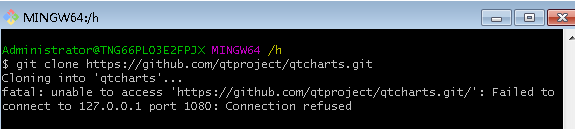

> 问题1：git clone出现 fatal: unable to access 'https://github.com/...'的解决办法(亲测有效)

如下图所示，当我试图克隆别人的repo时，会发生这样的错误，当我从git：/而不是https://，克隆时，它工作得很好。



发生这种情况是因为代理是在git中配置的。既然它是https代理（而不是http）git config http.proxy和git config --global http.proxy也无济于事。

**解决方案一**

1、看看你的git配置

```shell
git config --global -l
```

如果你没有任何与https代理相关的内容，例如https_proxy = ...问题不在这里。

如果您有与https代理相关的内容，请将其从〜/ .gitconfig文件中删除，然后重试。

2、如果仍然不起作用，请取消设置环境变量 

```shell
env|grep -i proxy  
```

 你应该有一行或几行https_proxy = ...

使用以下内容逐个取消设置：取消设置https_proxy（或HTTPS_PROXY，具体取决于变量的名称）

3、再次检查环境变量

```shell
env|grep -i proxy  
```

如果它没有显示任何你应该是好的。

注意：此解决方案可以应用于http和https代理问题。只是变量名称从https更改为http。

**解决方案二**

在开启shadowsocks的前提下，手动配置git的代理。git客户端输入如下两个命令就可以了。

```shell
git config --global http.proxy http://127.0.0.1:1080

git config --global https.proxy http://127.0.0.1:1080
```

http://也可以改成sockets5://,但是区别在于：socks5不支持通过pubkey免密登录github，每次提交代码只能输入用户名和密码。http可以支持免密登录。

**取消代理：**

```shell
git config --global --unset http.proxy 

git config --global --unset https.proxy 
```

其实方案一和方案二是同一种方法，不过方案二更加具体一点罢了，大部分问题都可以用方案二解决，当方案二无效时，考虑使用方案一。

> 问题2：github README.md插入图片,图片尺寸设置,图片无法显示解决

- 图片的引入

  ```shell
  网络资源图片引入方
    //[]中可选填图片文字说明,()*填写图片的url地址
  git仓库中的图片引入方式
  
  ```

- 设置图片尺寸

  ```html
  .md 中可以是标签样式设置图片大小, 具体方法
  
  ```

- README.md图片无法显示

  

  原因：如果你的README文件内显示图片的路径是正确的，那么很有可能是因为DNS被污染了所以导致显示不正常，即无法访问存放github图片素材的raw.githubusercontent.com站点。

  以win10为例，将`C:\Windows\System32\drivers\etc\hosts`文件拷贝到桌面（因为该文件是在C盘如果你不拷贝出来是无法进行修改的），打开该文件添加两行：

```
#GitHub Start
140.82.113.3      github.com
140.82.114.20     gist.github.com

151.101.184.133    assets-cdn.github.com
151.101.184.133    raw.githubusercontent.com
199.232.28.133     raw.githubusercontent.com
151.101.184.133    gist.githubusercontent.com
151.101.184.133    cloud.githubusercontent.com
151.101.184.133    camo.githubusercontent.com
199.232.96.133     avatars.githubusercontent.com
151.101.184.133    avatars0.githubusercontent.com
199.232.68.133     avatars0.githubusercontent.com
199.232.28.133     avatars0.githubusercontent.com
199.232.28.133     avatars1.githubusercontent.com
151.101.184.133    avatars1.githubusercontent.com
151.101.108.133    avatars1.githubusercontent.com
151.101.184.133    avatars2.githubusercontent.com
199.232.28.133     avatars2.githubusercontent.com
151.101.184.133    avatars3.githubusercontent.com
199.232.68.133     avatars3.githubusercontent.com
151.101.184.133    avatars4.githubusercontent.com
199.232.68.133     avatars4.githubusercontent.com
151.101.184.133    avatars5.githubusercontent.com
199.232.68.133     avatars5.githubusercontent.com
151.101.184.133    avatars6.githubusercontent.com
199.232.68.133     avatars6.githubusercontent.com
151.101.184.133    avatars7.githubusercontent.com
199.232.68.133     avatars7.githubusercontent.com
151.101.184.133    avatars8.githubusercontent.com
199.232.68.133     avatars8.githubusercontent.com
199.232.96.133     avatars9.githubusercontent.com
#GitHub End
  ```

  将修改后的hosts文件放回`C:\Windows\System32\drivers\etc\`目录下。

  打开命令行，输入：

  ```shell
  ipconfig /flushdns
  ```

   刷新DNS即可！

> 电脑内没有hosts文件怎么办
>
> - 方法1：我们进入C:\Windows\System32\drivers\etc文件夹，然后新建一个记事本。
>
>   ```
>   # Copyright (c) 1993-2009 Microsoft Corp.
>   
>   #
>   
>   # This is a sample HOSTS file used by Microsoft TCP/IP for Windows.
>   
>   #
>   
>   # This file contains the mappings of IP addresses to host names. Each
>   
>   # entry should be kept on an individual line. The IP address should
>   
>   # be placed in the first column followed by the corresponding host name.
>   
>   # The IP address and the host name should be separated by at least one
>   
>   # space.
>   
>   #
>   
>   # Additionally, comments (such as these) may be inserted on individual
>   
>   # lines or following the machine name denoted by a '#' symbol.
>   
>   #
>   
>   # For example:
>   
>   #
>   
>   #      102.54.94.97     rhino.acme.com          # source server
>   
>   #       38.25.63.10     x.acme.com              # x client host
>   
>   # localhost name resolution is handled within DNS itself.
>   
>   # 127.0.0.1       localhost
>   
>   # ::1             localhost
>   
>   #127.0.0.1 gilisoft.com
>   ```
>
>   保存后，将记事本 新建 文本文档.txt名字改为hosts，记住不要带后辍格式就叫hosts，然后系统会提示你是否确认更改格式，我们点击是就可以了。
>
> - 方法2：我们按下WIN+R呼出运行菜单，然后在运行菜单中输入：attrib %SystemRoot%\system32\drivers\etc\hosts -h -r -s  
>
>   然后我们继续在运行菜单中输入：notepad %SystemRoot%\system32\drivers\etc\hosts 这样就可以打开hosts文件了。


