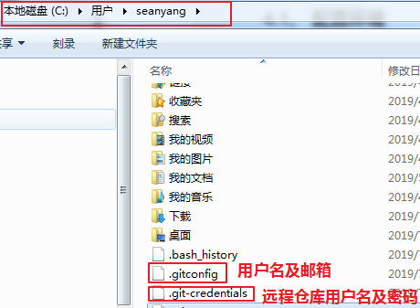

# 1、 SSH协议传输数据

## 1.1、Git支持的传输协议

由于Git的远程仓库并不在我们本地，当我们在使用远程仓库的时候（例如克隆、拉取、推送）就会涉及到数据的网络传输，Git支持多种数据传输协议本地协议（Local）。

-  HTTPS 协议
-  SSH（Secure Shell）协议
-  Git 协议

## 1.2、什么是SSH协议

SSH 为 Secure Shell（安全外壳协议）的缩写，由 IETF 的网络小组（Network Working Group）所制定。SSH 是目前较可靠，专为远程登录会话和其他网络服务提供安全性的协议。利用 SSH 协议可以有效防止远程管理过程中的信息泄露问题。

由于本地Git仓库和远程仓库之间的传输是通过SSH加密的，所以必须要让远程仓库服务器认证你的SSH key，在此之前，必须要生成SSH key。

使用ssh协议通信时，推荐使用基于密钥的验证方式。你必须为自己创建一对密匙（公钥和私钥），并把公匙放在需要访问的服务器上。

## 1.3、配置SSH协议

### 1.3.1、使用git命令创建公钥和私钥

使用命令ssh-keygen –t rsa生成公钥和私钥，执行完成后在windows本地用户.ssh目录C:\Users\用户名\.ssh下面生成如下名称的公钥和私钥。


### 1.3.2、配置公钥至远程仓库

在码云的设置中，添加公钥,需要进行密码验证：


## 1.4、配置SSH的注意事项


# 2、概述

## 2.1、开发中的实际场景

场景一：备份
   	小明负责的模块就要完成了，就在即将Release之前的一瞬间，电脑突然蓝屏，硬盘光荣牺牲！几个月来的努力付之东流

场景二：代码还原
		这个项目中需要一个很复杂的功能，老王摸索了一个星期终于有眉目了，可是这被改得面目全非的代码已经回不到从前了。什么地方能买到哆啦A梦的时光机啊？

场景三：协同开发
		小刚和小强先后从文件服务器上下载了同一个文件：Analysis.java。小刚在Analysis.java文件中的第30行声明了一个方法，叫count()，先保存到了文件服务器上；小强在Analysis.java文件中的第50行声明了一个方法，叫sum()，也随后保存到了文件服务器上，于是，count()方法就只存在于小刚的记忆中了
		
场景四：多版本同步开发不同期上线
		老许是一位项目经理，根据产品经理的要求，需要同步开发多个功能，但是会在不同的时间节点上线，针对同一工程和项目，应该怎么解决这个问题？
		
场景五：追溯问题代码的编写人和编写时间！
		老王是另一位项目经理，每次因为项目进度挨骂之后，他都不知道该扣哪个程序员的工资！就拿这次来说吧，有个Bug调试了30多个小时才知道是因为相关属性没有在应用初始化时赋值！可是二胖、王东、刘流和正经牛都不承认是自己干的！

## 2.2、版本控制器的方式
- 集中式版本控制工具

  集中式版本控制工具，版本库是集中存放在中央服务器的，team里每个人work时从中央服务器下载代码，是必须联网才能工作，局域网或互联网。个人修改后然后提交到中央版本库。

  - 举例：SVN和CVS

- 分布式版本控制工具

  分布式版本控制系统没有“中央服务器”，每个人的电脑上都是一个完整的版本库，这样工作的时候，无需要联网了，因为版本库就在你自己的电脑上。多人协作只需要各自的修改推送给对方，就能互相看到对方的修改了。

  - 举例：Git

## 2.3、SVN
SVN是一个开放源代码的版本控制系统，是Apache Subversion的缩写。SVN是集中式的管理。SVN必须有一个服务器版本库就放在一个中央服务器，所有开发人员都是与服务器进行交互的。

优点：具有很强的权限控制

缺点：严重依赖中央服务器


## 2.4、Git
Git是分布式的,Git不需要有中心服务器，我们每台电脑拥有的东西都是一样的。我们使用Git并且有个中心服务器，仅仅是为了方便交换大家的修改，但是这个服务器的地位和我们每个人的PC是一样的。我们可以把它当做一个开发者的pc就可以就是为了大家代码容易交流不关机用的。没有它大家一样可以工作，只不过“交换”修改不方便而已。

git是一个开源的分布式版本控制系统，可以有效、高速地处理从很小到非常大的项目版本管理。Git是Linus Torvalds 为了帮助管理 Linux 内核开发而开发的一个开放源码的版本控制软件。

同生活中的许多伟大事物一样，Git 诞生于一个极富纷争大举创新的年代。Linux 内核开源项目有着为数众多的参与者。 绝大多数的 Linux 内核维护工作都花在了提交补丁和保存归档的繁琐事务上（1991－2002年间）。 到 2002 年，整个项目组开始启用一个专有的分布式版本控制系统 BitKeeper 来管理和维护代码。

到了 2005 年，开发 BitKeeper 的商业公司同 Linux 内核开源社区的合作关系结束，他们收回了 Linux 内核社区免费使用 BitKeeper 的权力。 这就迫使 Linux 开源社区（特别是 Linux 的缔造者 Linus Torvalds）基于使用 BitKeeper 时的经验教训，开发出自己的版本系统。 他们对新的系统制订了若干目标：

-  速度
-  简单的设计
-  对非线性开发模式的强力支持（允许成千上万个并行开发的分支）
-  完全分布式
-  有能力高效管理类似 Linux 内核一样的超大规模项目（速度和数据量）


> 备注：
>
>  Clone：克隆，就是将远程仓库复制到本地
>
>  Push：推送，就是将本地仓库代码上传到远程仓库
>
>  Pull：拉取，就是将远程仓库代码下载到本地仓库
>
>  commit：提交，将工作区代码提交到本地仓库

## 2.5、Git工作流程图


**基本概念：**

1. 远程仓库 ： 在局域网或互联网上的一个主机，存放代码库的主机或平台，比如gitee.com(码云)

2. 本地仓库： 在本地主机上的一个代码库，可以独立存在，也可以与远程仓库进行关联

   凡是一个文件夹，包含.git隐藏文件夹（git工作目录），说明此文件目录使用git版本管理。.git文件目录中存储了很多配置信息、日志信息和文件版本信息、工作区、暂存区信息等。.git文件夹中有很多文件，其中有一个index文件就是暂存区，也可以叫做stage。暂存区是一个临时保存修改文件的地方。

3. 工作区：对任何文件的修订(增删改)，都先放在工作区，工作区不与任何仓库分支进行关联

4. 暂存区：把修订的文件，从工作区经过add（添加）后与某一个仓库分支进行关联，只要进入缓存区的文件才能commit(提交)到本地仓库。

5. 分支：代码存放在仓库，默认是主分支(master)，可以在主分支基础上创建很多子分支，比如develop（开发）、bugfix（bug修复）等。

**命令如下：**

1．clone（克隆）: 从远程仓库中克隆代码到本地仓库

 fetch (抓取) ： 从远程库，抓取到本地仓库，不进行任何的合并动作，一般操作比较少。

2．checkout （检出）:从本地仓库中检出一个仓库分支然后进行修订

3．add（添加）: 在提交前先将代码提交到暂存区

4．commit（提交）: 提交到本地仓库。本地仓库中保存修改的各个历史版本

5 . pull (拉取) ： 从远程库拉到本地库，自动进行合并(merge)，然后放到到工作区，相当于fetch+merge

6．push（推送） : 修改完成后，需要和团队成员共享代码时，将代码推送到远程仓库

## 2.6、工作目录下的状态
Git工作目录下的文件存在两种状态：

untracked 未跟踪（未被纳入版本控制）

tracked 已跟踪（被纳入版本控制）        

Unmodified 未修改状态

Modified 已修改状态

Staged  已暂存状态

这些文件的状态会随着我们执行Git的命令而发生变化

# 3、Git常用命令

## 3.1、下载与安装

下载地址： https://git-scm.com/download

双击下载的安装文件来安装Git。安装完成后在电脑桌面（也可以是其他目录）点击右键，如果能够看到如下两个菜单则说明Git安装成功。

备注：

 Git GUI：Git提供的图形界面工具

 Git Bash：Git提供的命令行工具

## 3.2、设置用户信息

```shell
 git config --global user.name “itcast”

 git config --global user.email “[hello@itcast.cn](mailto:hello@itcast.cn)”

 git config --global credential.helper store # git push的时候记住用户名和密码
```

当安装Git后首先要做的事情是设置用户名称和email地址。这是非常重要的，因为每次Git提交都会使用该用户信息



 查看配置信息

```shell
 git config --list

 git config user.name
```

通过上面的命令设置的信息会保存在~/.gitconfig文件中

## 3.3、常用的命令行

> #####  第1步：建立本地 git 仓库，cd 到你的本地项目根目录下，执行 git init 命令**
>
> ```
> git init  //这个目录就变成了git可以管理的仓库 
> ```
>
> ##### 第2步：将本地项目工作区的所有文件添加到暂存区。小数点 “.” ，意为添加文件夹下的所有文件；也可以将 “.” 换成具体的文件名，如果想添加项目中的指定文件，那就把 “.” 改为指定文件名即可**
>
> ```
> git add . 
> ```
>
> ##### 第3步：将暂存区的文件提交到本地仓库
>
> ```
> git commit -m "注释说明" 
> ```
>
> ##### 第4步：在 github 或者 gitlab 上创建新的repository，本文基于 github 操作，gitlab 类似。
>
> ##### 第5步：将本地代码仓库关联到 github 上
>
> ```
> git remote add origin https://github.com/KeymonWong/JsAndObjc.git 
> 
> "[https://github.com/KeymonWong/JsAndObjc.git](https://link.jianshu.com/?t=https://github.com/KeymonWong/JsAndObjc.git)" 就是我在第四步时复制的那个https地址
> 
> 在这一步时如果出现错误：
> 
> fatal:remote origin already exists
> 
> 那就先输入
> 
> git remote rm origin 
> 
> 再输入
> 
> git remote add origin https://github.com/KeymonWong/JsAndObjc.git 
> 
> 就不会报错了。
> ```
>
> ##### 第6步：将代码由本地仓库上传到 github 远程仓库，依次执行下列语句
>
> ```
> 6-1、 获取远程库与本地同步合并（如果远程库不为空必须做这一步，否则后面的提交会失败）：
> git pull --rebase origin master
>  //执行完之后如果无错误就上传成功了，需要提示的是这里的 master 是 github 默认的分支， //如果你本地的当前分支不是 master，就用git checkout master命令切换到master分支， //如果你想用本地当前分支上传代码，则把第6步的命令里的 master 切换成你的当前分支名即可。 
> 
> 6-2、把当前分支 master 推送到远程，执行此命令后有可能会让输入用户名、密码：
> git push -u origin master  
>  //执行完之后如果无错误就上传成功了，需要提示的是这里的 master 是 github 默认的分支， //如果你本地的当前分支不是 master，就用git checkout master命令切换到master分支， //如果你想用本地当前分支上传代码，则把第6步的命令里的 master 切换成你的当前分支名即可。
> ```
>
> **至此，操作成功！**
>
> 1、首先先进入本地想要上传的项目文件夹，通过 git init 命令将这个目录变成git 可以管理的目录。
>
> 2、git add . 命令将文件添加到暂存区。要注意“ . ”意思是文件夹下的所有文件
>
> 3、git commit -m "提交文件说明" 命令是告诉git ，把文件提交到仓库。引号里面的内容是提交说明。
>
> 4、git remote add origin 你的远程地址(Use HTTPS) 关联到远程仓库
>
> 5、git pull --rebase origin master 获取远程库与本地同步合并，如果远程仓库不是空的话，就必须要做这步，不然后面就会失败的，我每次不成功，问题都是出现在这了
>
> 6、git push -u origin master 命令是把当前分支master推送到远程。执行此命令后会要求输入用户名和密码，然后就开始上传了
>
> 7、git status 状态查询命令

# 4、idea解决Git冲突

## 4.1、什么是冲突

冲突是指当你在提交或者更新代码时被合并的文件与当前文件不一致。读起来有点绕，结合下面的案例理解。

从上面对冲突的定义来看，冲突时发生在同一个文件上的。

## 4.2、2.生产上冲突的场景

常见冲突的生产场景如下

1. 更新代码
2. 提交代码
3. 多个分支代码合并到一个分支时
4. 多个分支向同一个远端分支推送代码时

> git的合并中产生冲突的具体情况：
>
> 　　<1>两个开发者（分支中）修改了同一个文件（不管什么地方）
>
> 　　<2>两个开发者（分支中）修改了同一个文件的名称
>
> 注意：两个分支中分别修改了不同文件中的部分，不会产生冲突，可以直接将两部分合并。
>
> 总结：上面各种情况的本质都是，当前文件与合并文件不一致，因此不论哪种情况其解决冲突的方法是一样的。

## 4.3、idea中解决冲突

模拟场景：

假设有另个开发人员开发同一个项目，并且编写同一个文件,工作流程如下：

- 01号程序员先上传文件conflict.txt，并继续在conflict.txt上写代码；

  

- 02号程序员更新项目代码，并在conflict.txt上写代码，写完后，在提交到远程服务端；

  

- 当01号程序员把写完后，准备提交代码了，这时的正规操作手法，先更新在提交，但是在更新的时候必然会冲突，因为这时候更新的代码conflict.txt与本地仓库代码conflict.txt不一致

  

- 提交前，我要更新，冲突了：

  

  > 解决方案如下：
  >
  > 　　accept yours:代表以自己的为准；
  >
  > 　　accept theris:代表以更新下来的文件为准；
  >
  > 　　merge:代表手动合并
  >
  > 　　一般解决冲突我们都是选择merge

- 解决办法

  

  > 将需要的内容点击：">>"既可以合并内容到result中，不需要的内容点击“x”即可，合并完成后点击apply即可。
  >
  > 值得注意的是，最将所有的“x >>”符号都要处理完，不需要的点击“x”,需要的点击“>>”
  >
  > 最后，不论是什么场景下产生的冲突解决方法是一样的。

## 4.4、4.关于冲突的个人心得

　　多人协作开发的时候,如果出现了你没有改过的文件跟你冲突了,一定要去找到当事者,说清楚是如何冲突的；

　　然后协商解决,千万不要擅自拉别的分支去试图解决冲突,或找文件覆盖，更或者以自己的文件为准.

　　同时记住,解决了之后,要add 和 commit 最后push.为保证万无一失,最后在冲突都解决之后,重启项目；

　　保证至少不会有立即奔溃的现象发生.然后才去提交,push.

　　提交的时候,一定要保持清醒,先搞清楚自己要提交的文件之间的关系,然后再提交,这样才不会有文件缺失的问题,造成奔溃.

　　如果任务比较多,又开了多个分支,分别进行开发,再次强调，一定要清楚自己在各个分支上做了什么,自己要提交的是什么.最好是能做个详细的笔记，没有把握宁愿不要去提交到生产服务器.

　　提交代码的时候不要走神,因为这是一个神圣的时刻