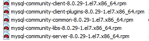

# 1、Linux的概述

Linux是基于Unix的开源免费的操作系统，由于系统的稳定性和安全性几乎成为程序代码运行的最佳系统环境。Linux是由Linus Torvalds（林纳斯·托瓦兹）起初开发的，由于源代码的开放性，现在已经衍生出了成千上百种不同的Linux系统。

Linux系统的应用非常广泛，不仅可以长时间的运行我们编写的程序代码，还可以安装在各种计算机硬件设备中，比如手机、平板电脑、路由器等。尤其在这里提及一下，我们熟知是Android程序最底层就是运行在linux系统上的。

# 2、Linux的分类

(1)Linux根据市场需求不同，基本分为两个方向：

1）图形化界面版：注重用户体验，类似window操作系统，但目前成熟度不够

2）服务器版：没有好看的界面，是以在控制台窗口中输入命令操作系统的，类似 于DOS，是我们架设服务器的最佳选择

(2)Linux根据原生程度，又分为两种：

1）内核版本：在Linus领导下的内核小组开发维护的系统内核的版本号；

2）发行版本：一些组织或公司在内核版基础上进行二次开发而重新发行的版本。

(3)Linux发行版本不同，又可以分为n多种：


# 3、关机与重启

```shell
# 重启命令：reboot
[root@localhost ~]# reboot
# 立即关机：halt
[root@localhost ~]# halt
# 注销：exit
[root@localhost ~]# exit
# 立刻重启(root用户使用)
[root@localhost ~]# shutdown -r now   
# 立刻关机(root用户使用)。
[root@localhost ~]# shutdown -h now   
#  10分钟后自动关机。   
[root@localhost ~]# shutdown -h 10   
# 在时间为20:35时候重启(root用户使用)   
[root@localhost ~]# shutdown -r 20:35     
```

# 4、防火墙及端口

```shell
# 查看防火墙状态
[root@localhost ~]# firewall-cmd --state
# 或者
[root@localhost ~]# systemctl status firewalld
## 6.3、关闭防火墙
[root@localhost ~]# systemctl stop firewalld
[root@localhost ~]# firewall-cmd --relaod
# 或者
[root@localhost ~]# systemctl reload firewalld
# 开机自启动防火墙
[root@localhost ~]# systemctl enable firewalld
# 禁止开机启动防火墙
[root@localhost ~]# systemctl disable firewalld
# 查看已打开的端口
[root@localhost ~]# firewall-cmd --list-ports
# 开放或者关闭端口都需要重启防火墙#
[root@localhost ~]# firewall-cmd --permanent --zone=public --add-port=8080/tcp
# 开放或者关闭端口都需要重启防火墙#
[root@localhost ~]# firewall-cmd --permanent --zone=public --remove-port=8080/tcp
```

# 4 、用户组及用户

```shell
# 添加用户组
[root@localhost ~]# groupadd dev
# 修改组
[root@localhost ~] groupmod -n dev  dev1 
# 删除用户组
[root@localhost ~]# groupdel dev
# 查询组
[root@localhost ~]# cat /etc/group 
# 或者使用管道来精确查询 
[root@localhost ~]# cat /etc/group | grep dev
# 查看当前登录用户所在的组 groups
[root@localhost ~]# groups someuser
# 注意：-m 自动建立用户加目录； -g 指定用户所在的组，否则会建立一个和用户名同名的组 
[root@localhost ~]# useradd -m -g dev test1
# 修改用户 
# 示例：修改和创建密码 passwd 用户名    如果不加用户名则默认修改当前登录者的密码
[root@localhost ~]# passwd test1   输入两次newpwd
# 示例：将test用户的登录目录改成/home/test，并加入test2组，注意这里是大G。
[root@localhost ~]# usermod -d /home/test -G test2 test 
# 示例：将用户test加入到test2组
[root@localhost ~]#  gpasswd -a test test2 
或者
[root@localhost ~]#  usermod -g test2 test
# 示例：将用户test从test2组中移出
[root@localhost ~]# gpasswd -d test test2 
# 设置用户不能修改密码
[root@localhost ~]# passwd -l test1     //在root下，禁止test1用户修改密码的权限
[root@localhost ~]# passwd -d test1    //在root下，删除test1的密码
[root@localhost ~]# passwd -S test1     //在root下，查看test1的密码
# 删除用户：
# 删除用户username
[root@localhost ~]# userdel username  
# 删除用户username所在目录
[root@localhost ~]# rm -rf username   
# 查看用户
# 示例： 查看当前登录的所有用户
[root@localhost ~]# w
[root@localhost ~]# who
# 示例：查看当前登录用户名
[root@localhost ~]# whoami
# 将用户加入到wheel组，即可使用sudo权限，相当于管理员
[root@localhost ~]# usermod -a -G wheel someuser
```

# 5、权限与分配

权限是Linux中的重要概念，每个文件/目录等都具有权限，通过ls -l命令我们可以 查看某个目录下的文件或目录的权限。

```shell
# 示例：在随意某个目录下ls -l
[root@localhost local]# ls -l
总用量 0
drwxr-xr-x. 2 root root 134 8月  18 10:07 
bindrwxr-xr-x. 2 root root   6 4月  11 2018 
etcdrwxr-xr-x. 2 root root   6 4月  11 2018 
gamesdrwxr-xr-x. 2 root root   6 4月  11 2018 
includedrwxr-xr-x. 2 root root  39 8月  17 18:20 
influxdbdrwxr-xr-x. 2 root root   6 4月  11 2018 
libdrwxr-xr-x. 2 root root   6 4月  11 2018 
lib64drwxr-xr-x. 2 root root   6 4月  11 2018 
libexecdrwxr-xr-x. 3 root root  51 8月  18 10:04 
redisdrwxr-xr-x. 2 root root   6 4月  11 2018 
sbindrwxr-xr-x. 5 root root  49 8月   9 22:42 
sharedrwxr-xr-x. 2 root root   6 4月  11 2018 src
# 示例：修改/test下的aaa.txt的权限为属主有全部权限，属主所在的组有读写权限，其他用户只有读的权限
[root@localhost ~]# chmod u=rwx,g=rw,o=r aaa.txt
# 上述示例还可以使用数字表示：
[root@localhost ~]# chmod 764 aaa.txt
#修改某个目录(包括子目录)为某有用户(user3)
[root@localhost ~]# chown -R user3 /opt/cki/ruoyi/automonitor/app
```

<table>
    <tr>
       <td colspan='3'>属主（user）</td>
        <td colspan='3'>属组（group）</td>  
        <td colspan='3'>其他用户</td>
    </tr>
    <tr>
       <td>r</td>
        <td>w</td>
        <td>x</td>
        <td>r</td>
        <td>w</td>
        <td>x</td>
        <td>r</td>
        <td>w</td>
        <td>x</td>
    </tr>
    <tr>
       <td>4</td>
        <td>2</td>
        <td>1</td>
        <td>4</td>
        <td>2</td>
        <td>1</td>
        <td>4</td>
        <td>2</td>
        <td>1</td>
    </tr>
</table>

# 6、常用命令

> 目录介绍
>
> - bin :存放二进制可执行文件
> - sbin：存放二进制可执行文件，只有root可以访问
> - etc：存放系统配置文件
> - usr：用于存放共享的系统资源
> - home：存放用户文件的根目录
> - root：超级用户目录
> - dev：用于存放设备文件
> - lib：存放跟文件系统中的程序运行所需要的共享库及内核模块
> - mnt：系统管理员安装临时文件系统的安装点
> - boot：存放用于系统引导时使用的各种文件
> - tmp：用于存放各种零食文件
> - var：用于存放运行时需要改变的数据文件
>
> 推荐使用SSH工具（FinalShell、SecureCRT、xshell）

## 6.1、文件管理指令

> 命令：touch 文件名称 ----- 空文件

```shell
# 示例：在test目录下创建一个空文件 touch aaa.txt
[root@localhost ~]#touch aaa.txt
```

### 6.1.1、ls命令 – 显示指定工作目录下的文件及属性信息

> ls是最常被使用到的Linux命令之一，来自于英文单词list的缩写，也正如list单词的英文意思，其功能是列举出指定目录下的文件名称及其属性。
>
> 默认不加参数的情况下，ls命令会列出当前工作目录中的文件信息，经常与cd和pwd命令搭配使用，十分方便。而带上参数后，我们则可以做更多的事情，作为最基础、最频繁使用的命令，有必要仔细了解下其常用功能。
>

**常用参数：**

| -a      | 显示所有文件及目录 (包括以“.”开头的隐藏文件)     |
| ------- | ------------------------------------------------ |
| -l      | 使用长格式列出文件及目录的详细信息               |
| -r      | 将文件以相反次序显示(默认依英文字母次序)         |
| -t      | 根据最后的修改时间排序                           |
| -A      | 同 -a ，但不列出 “.” (当前目录) 及 “..” (父目录) |
| -S      | 根据文件大小排序                                 |
| -R      | 递归列出所有子目录                               |
| -d      | 查看目录的信息，而不是里面子文件的信息           |
| -i      | 输出文件的inode节点信息                          |
| -m      | 水平列出文件，以逗号间隔                         |
| -X      | 按文件扩展名排序                                 |
| --color | 输出信息中带有着色效果                           |

**参考实例**

输出当前目录中的文件（默认不含隐藏文件）：

```shell
[root@root ~]# ls
anaconda-ks.cfg  Documents  initial-setup-ks.cfg  Pictures  Templates
Desktop          Downloads  Music                 Public    Videos
```

输出当前目录中的文件（含隐藏文件）：

```shell
[root@root ~]# ls -a
.                .bashrc  Documents             Music      Videos
..               .cache   Downloads             Pictures   .viminfo
anaconda-ks.cfg  .config  .esd_auth             .pki
.bash_history    .cshrc   .ICEauthority         Public
.bash_logout     .dbus    initial-setup-ks.cfg  .tcshrc
.bash_profile    Desktop  .local                Templates
```

输出文件的长格式，包含属性详情信息：

```shell
[root@root ~]# ls -l
total 8
-rw-------. 1 root root 1430 Dec 14 08:05 anaconda-ks.cfg
drwxr-xr-x. 2 root root    6 Dec 14 08:37 Desktop
drwxr-xr-x. 2 root root    6 Dec 14 08:37 Documents
drwxr-xr-x. 2 root root    6 Dec 14 08:37 Downloads
-rw-r--r--. 1 root root 1585 Dec 14 08:34 initial-setup-ks.cfg
drwxr-xr-x. 2 root root    6 Dec 14 08:37 Music
drwxr-xr-x. 2 root root    6 Dec 14 08:37 Pictures
drwxr-xr-x. 2 root root    6 Dec 14 08:37 Public
drwxr-xr-x. 2 root root    6 Dec 14 08:37 Templates
drwxr-xr-x. 2 root root    6 Dec 14 08:37 Videos
```

输出指定目录中的文件列表：

```shell
[root@root ~]# ls /etc
adjtime                     hosts                     pulse
aliases                     hosts.allow               qemu-ga
alsa                        hosts.deny                qemu-kvm
alternatives                hp                        radvd.conf
anacrontab                  idmapd.conf               ras
asound.conf                 init.d                    rc0.d
at.deny                     inittab                   rc1.d
………………省略部分输出信息………………
```

输出文件名称及inode属性块号码：

```shell
[root@root ~]# ls -i
35290115 anaconda-ks.cfg  35290137 initial-setup-ks.cfg  35290164 Templates
 1137391 Desktop          17840039 Music                 51609597 Videos
 1137392 Documents        35290165 Pictures
17840038 Downloads        51609596 Public
```

搭配通配符一起使用，输出指定目录中所有以sd开头的文件名称：

```shell
[root@root ~]# ls /dev/sd*
/dev/sda  /dev/sda1  /dev/sda2
```

依据文件大小进行排序，输出指定目录中文件属性详情信息：

```shell
[root@root ~]# ls -Sl /etc
total 1348
-rw-r--r--.  1 root root    692241 Sep 10  2018 services
-rw-r--r--.  1 root root     66482 Dec 14 08:34 ld.so.cache
-rw-r--r--.  1 root root     60352 May 11  2017 mime.types
-rw-r--r--.  1 root dnsmasq  26843 Aug 12  2018 dnsmasq.conf
-rw-r--r--.  1 root root     25696 Dec 12  2018 brltty.conf
-rw-r--r--.  1 root root      9450 Aug 12  2018 nanorc
-rw-r--r--.  1 root root      7265 Dec 14 08:03 kdump.conf
-rw-------.  1 tss  tss       7046 Aug 13  2018 tcsd.conf
………………省略部分输出信息………………
```

### 6.1.2、cp命令 – 复制文件或目录

> cp命令来自于英文单词copy的缩写，用于将一个或多个文件或目录复制到指定位置，亦常用于文件的备份工作。-r参数用于递归操作，复制目录时若忘记加则会直接报错，而-f参数则用于当目标文件已存在时会直接覆盖不再询问，这两个参数尤为常用。

**常用参数：**

| -f   | 若目标文件已存在，则会直接覆盖原文件                         |
| ---- | ------------------------------------------------------------ |
| -i   | 若目标文件已存在，则会询问是否覆盖                           |
| -p   | 保留源文件或目录的所有属性                                   |
| -r   | 递归复制文件和目录                                           |
| -d   | 当复制符号连接时，把目标文件或目录也建立为符号连接，并指向与源文件或目录连接的原始文件或目录 |
| -l   | 对源文件建立硬连接，而非复制文件                             |
| -s   | 对源文件建立符号连接，而非复制文件                           |
| -b   | 覆盖已存在的文件目标前将目标文件备份                         |
| -v   | 详细显示cp命令执行的操作过程                                 |
| -a   | 等价于“pdr”选项                                              |

**参考实例**

将/usr下的newTest拷贝到根目录下的test中，使用cp -r /usr/newTest /test

```shell
[root@localhost ~]# cp -r /usr/newTest /home/test
```

在当前工作目录中，将某个文件复制一份，并定义新文件名称：

```shell
[root@root ~]# cp anaconda-ks.cfg kickstart.cfg
```

在当前工作目录中，将某个目录复制一份，并定义新目录名称：

```shell
[root@root ~]# cp -r Documents Doc
```

复制某个文件时，保留其原始权限及用户归属信息：

```shell
[root@root ~]# cp -a kickstart.cfg ks.cfg
```

将某个文件复制到/etc目录中，并覆盖已有文件，不进行询问：

```shell
[root@root ~]# cp -f ks.cfg /etc
```

将多个文件一同复制到/etc目录中，如已有目标文件名称则默认询问是否覆盖：

```shell
[root@root ~]# cp anaconda-ks.cfg ks.cfg /etc
cp: overwrite '/etc/ks.cfg'? y
```

### 6.1.3、mkdir命令 – 创建目录文件

> mkdir命令来自于英文语句“make directories”的缩写，其功能是用来创建目录文件。使用简单，但需要注意若要创建的目标目录已经存在，则会提示已存在而不继续创建，不覆盖已有文件。而目录不存在，但具有嵌套的依赖关系，例如a/b/c/d/e/f，要想一次性创建则需要加入-p参数，进行递归操作。

**常用参数：**

| -p   | 递归创建多级目录             |
| ---- | ---------------------------- |
| -m   | 建立目录的同时设置目录的权限 |
| -z   | 设置安全上下文               |
| -v   | 显示目录的创建过程           |

**参考实例**

在当前工作目录中，建立一个目录文件：

```shell
[root@root ~]# mkdir dir1
```

在当前工作目录中，创建一个目录文件并设置700权限，不让除所有主以外任何人读、写、执行它：

```shell
[root@root ~]# mkdir -m 700 dir2
```

在当前工作目录中，一次性创建多个目录文件：

```shell
[root@root ~]# mkdir dir3 dir4 dir5
```

在系统根目录中，一次性创建多个有嵌套关系的目录文件：

```shell
[root@root ~]# mkdir -p /dir1/dir2/dir3/dir4/dir5
```

### 6.1.4 、mv命令 – 移动或改名文件

> mv命令来自于英文单词move的缩写，其功能与英文含义相同，用于对文件进行剪切和重命名。
>
> 这是一个高频使用的文件管理命令，我们需要留意它与复制命令的区别。cp命令是用于文件的复制操作，文件个数是增加的，而mv则为剪切操作，也就是对文件进行移动（搬家）操作，文件位置发生变化，但总个数并无增加。
>
> 在同一个目录内对文件进行剪切的操作，实际应理解成重命名操作，例如下面的实例一所示。

**常用参数：**

| -i   | 若存在同名文件，则向用户询问是否覆盖                         |
| ---- | ------------------------------------------------------------ |
| -f   | 覆盖已有文件时，不进行任何提示                               |
| -b   | 当文件存在时，覆盖前为其创建一个备份                         |
| -u   | 当源文件比目标文件新，或者目标文件不存在时，才执行移动此操作 |

**参考实例**

在当前工作目录中，对某个文件进行剪切后粘贴（重命名）操作：

```
[root@root ~]# mv anaconda-ks.cfg ks.cfg
```

将某个文件移动到/etc目录中，保留文件原始名称：

```
[root@root ~]# mv ks.cfg /etc
```

将某个目录移动到/etc目录中，并定义新的目录名称：

```
[root@root ~]# mv Documents /etc/docs
```

将/home目录中所有的文件都移动到当前工作目录中，遇到已存在文件则直接覆盖：

```
[root@root ~]# mv -f /home/* .
```

### 6.1.5、pwd命令 – 显示当前工作目录的路径

> pwd命令来自于英文语句”print working directory“的缩写，其功能是用于显示当前工作目录的路径，即显示所在位置的绝对路径。
>
> 在实际工作中，我们经常会在不同目录之间进行切换，为了防止”迷路“，可以使用pwd命令快速查看当前所处的工作目录路径，方便开展后续工作。

**常用参数：**

| -L   | 显示逻辑路径 |
| ---- | ------------ |

**参考实例**

查看当前工作目录路径：

```
[root@root ~]# pwd
/root
```

### 6.1.6、vim指令 - 文件编辑

> vi命令是linux系统字符界面下的最常用的文本编辑器。
>
> vi编辑器是所有linux的标准编辑器，用于编辑任何ASCⅡ文本，对于编辑源程序尤其有用。iv编辑器功能非常强大，可以对文本进行创建，查找，替换，删除，复制和粘贴等操作。
>
> 在linux系统shell提示符中输入vi和文件名后，就进入vi编辑界面。如果系统内还不存在该文件，就等于新建文件，如果系统内存在给文件，就意味着编辑该文件。
>
> 点击键盘i/a/o进入编辑模式，可以 编辑文件编辑完成后，按下Esc，退回命令模式；此时文件虽然已经编辑完成，但是没有保存，需输入冒号：进入底行模式，在底行模 式下输入wq代表写入内容并退出，即保存；输入q!代表强制退出不保存。

**常用参数：**

| -s               | 静默模式                             |
| ---------------- | ------------------------------------ |
| -- -cmd<命令>    | 加载任何vimrc文件之前执行指定命令    |
| -R               | 只读模式                             |
| -v               | Vi模式                               |
| -e               | Ex模式                               |
| -y               | 简易模式                             |
| -- --            | 之后只有文件名                       |
| -c<命令>         | 加载第一个文件之后执行指定命令       |
| -s<脚本输入文件> | 从指定脚本输入文件阅读普通模式命令   |
| -w<脚本输出文件> | 追加所有类型的命令写入脚本输出文件   |
| -W<脚本输出文件> | 写入所有类型的命令到指定脚本输出文件 |
| +                | 从文件末尾开始                       |
| +<行数>          | 从指定行开始                         |
| -- -noplugin     | 不要加载插件脚本                     |
| -p<数量>         | 打开指定数量的标签页（带文件名）     |
| -r<文件名>       | 恢复崩溃的会话                       |
| -L               | 等同于-r                             |
| -r               | 列出交换文件并退出                   |
| -u<vimrc>        | 熟用指定vimrc，而不是.vimrc          |
| -T<终端>         | 设置使用指定终端                     |
| -o<数量>         | 打开指定数量的窗口                   |
| -n               | 不使用交换文件，只用内存             |
| -Z               | 受限模式                             |
| -m               | 不允许修改（写入）                   |
| -b               | 二进制模式                           |
| -M               | 在文本中不允许修改                   |

使用vi编辑器：

```shell
[root@root ~]# vi
```

编辑指定文件：

```shell
[root@root ~]# vi linuxcool.log
```

从第6行开始编辑指定文件：

```shell
[root@root ~]# vi +6 linuxcool.log
```

以只读模式打开指定文件：

```shell
[root@root ~]# vi -R linuxcool.log 
```

## 6.2、文档编辑指令

### 6.2.1、cat命令 – 在终端设备上显示文件内容

> cat命令来自于英文单词concatenate的缩写，其功能是用于查看文件内容。在Linux系统中有很多用于查看文件内容的命令，例如more、tail、head……等等，每个命令都有各自的特点。cat命令适合查看内容较少的、纯文本的文件。
>
> 对于内容较多的文件，使用cat命令查看后会在屏幕上快速滚屏，用户往往看不清所显示的具体内容，只好按Ctrl+c键中断命令的执行，所以对于大文件，干脆用more命令吧~
>
> ```
> 命令：cat/more/less/tail 文件
> 注意：命令 tail -f 文件 可以对某个文件进行动态监控，例如tomcat的日志文件，会随着程序的运行，日志会变化，可以使用tail -f catalina-2016-11-11.log 监控文件的变化
> # 示例：使用cat查看/etc/sudo.conf文件，只能显示最后一屏内容
> [root@localhost ~]# cat /etc/sudo.conf
> # 示例：使用more查看/etc/sudo.conf文件，可以显示百分比，回车可以向下一行，空格可以向下一页，q可以退出查看
> [root@localhost ~]# more /etc/sudo.conf
> # 示例：使用less查看/etc/sudo.conf文件，可以使用键盘上的PgUp和PgDn向上 和向下翻页，q结束查看
> [root@localhost ~]# less /etc/sudo.conf
> # 示例：使用tail -10 查看/etc/sudo.conf文件的后10行，Ctrl+C结束
> [root@localhost ~]# tail -f ../logs/catalina.out
> [root@localhost ~]# tail -n 20 ../logs/catalina.out
> ```

**常用参数：**

| -n        | 显示行数（空行也编号）                  |
| --------- | --------------------------------------- |
| -s        | 显示行数（多个空行算一个编号）          |
| -b        | 显示行数（空行不编号）                  |
| -E        | 每行结束处显示$符号                     |
| -T        | 将TAB字符显示为 ^I符号                  |
| -v        | 使用 ^ 和 M- 引用，除了 LFD 和 TAB 之外 |
| -e        | 等价于”-vE”组合                         |
| -t        | 等价于”-vT”组合                         |
| -A        | 等价于 -vET组合                         |
| --help    | 显示帮助信息                            |
| --version | 显示版本信息                            |

**参考实例**

查看某个文件的内容：

```shell
[root@root ~]# cat anaconda-ks.cfg
#version=RHEL8
ignoredisk --only-use=sda
autopart --type=lvm
# Partition clearing information
………………省略部分输出信息………………
```

查看某个文件的内容，并显示行号：

```shell
[root@root ~]# cat -n anaconda-ks.cfg
     1	#version=RHEL8
     2	ignoredisk --only-use=sda
     3	autopart --type=lvm
     4	# Partition clearing information
     5	clearpart --none --initlabel
     6	# Use graphical install
………………省略部分输出信息………………
```

搭配空设备文件和输出重定向操作符，将某个文件内容清空：

```shell
[root@root ~]# cat /dev/null > anaconda-ks.cfg 
[root@root ~]# cat anaconda-ks.cfg 
[root@root ~]# 
```

持续写入文件内容，直到碰到EOF符后才会结束并保存：

```shell
[root@root ~]# cat > anaconda-ks.cfg << EOF
> Hello,World
> Linux!~
> EOF
[root@root ~]# cat anaconda-ks.cfg 
Hello,World
Linux!~
```

搭配输出重定向操作符，将光盘设备制作成镜像文件：

```shell
[root@root ~]# cat /dev/cdrom > rhel.iso
[root@root ~]# ls rhel.iso  -lh
-rw-r--r--. 1 root root 6.7G May  2 00:43 rhel.iso
[root@root ~]# file rhel.iso 
rhel.iso: DOS/MBR boot sector; partition 2 : ID=0xef, start-CHS (0x3ff,254,63), end-CHS (0x3ff,254,63), startsector 23128, 19888 sectors
```

### 6.2.2、echo命令 – 输出字符串或提取后的变量值

> echo是用于在终端设备上输出指定字符串或变量提取后值的命令，能够给用户一些简单的提醒信息，也可以将输出的指定字符串内容同管道符一起传递给后续命令作为标准输入信息再来进行二次处理，又或者同输出重定向符一起操作，将信息直接写入到文件中。
>
> 如需提取变量值，需在变量名称前加入$符号做提取，变量名称一般均为大写形式。

**常用参数：**

| -n       | 不输出结尾的换行符               |
| -------- | -------------------------------- |
| -e “\a”  | 发出警告音                       |
| -e “\b”  | 删除前面的一个字符               |
| -e “\c”  | 结尾不加换行符                   |
| -e “\f”  | 换行，光标扔停留在原来的坐标位置 |
| -e “\n”  | 换行，光标移至行首               |
| -e “\r”  | 光标移至行首，但不换行           |
| -E       | 禁止反斜杠转移，与-e参数功能相反 |
| —version | 查看版本信息                     |
| --help   | 查看帮助信息                     |

**参考实例**

输出指定字符串到终端设备界面（默认为电脑屏幕）：

```shell
[root@root ~]# echo LinuxCool
LinuxCool
```

输出某个变量值内容：

```shell
[root@root ~]# echo $PATH
/usr/local/bin:/usr/local/sbin:/usr/bin:/usr/sbin:/root/bin
```

搭配转义符一起使用，输出纯字符串内容：

```shell
[root@root ~]# echo \$PATH
$PATH
```

搭配输出重定向符一起使用，将字符串内容直接写入文件中：

```shell
[root@root ~]# echo "Hello World" > Document
```

搭配反引号执行命令，并将执行结果输出：

```shell
[root@root ~]# echo `uptime`
16:16:12 up 52 min, 1 user, load average: 0.00, 0.00, 0.00
```

输出带有换行符的内容：

```shell
[root@root ~]# echo -e "First\nSecond\nThird"
First
Second
Third
```

指定删除字符串中某些字符，随后将内容输出：

```shell
[root@root ~]# echo -e "123\b456" 
12456
```

### 6.2.3、rm命令 – 删除文件或目录

> rm命令来自于英文单词remove的缩写，其功能是用于删除文件或目录，一次可以删除多个文件，或递归删除目录及其内的所有子文件。
>
> rm也是一个很危险的命令，使用的时候要特别当心，尤其对于新手更要格外注意，如执行rm -rf /*命令则会清空系统中所有的文件，甚至无法恢复回来。所以我们在执行之前一定要再次确认下在哪个目录中，到底要删除什么文件，考虑好后再敲击回车，时刻保持清醒的头脑。

**常用参数：**

| -f   | 强制删除（不二次询问）   |
| ---- | ------------------------ |
| -i   | 删除前会询问用户是否操作 |
| -r/R | 递归删除                 |
| -v   | 显示指令的详细执行过程   |

**参考实例**

删除某个文件，默认会进行二次确认，敲击y进行确认。

```shell
[root@root ~]# rm anaconda-ks.cfg 
rm: remove regular file 'anaconda-ks.cfg'? y
```

删除某个文件，强制操作不需要二次确认：

```shell
[root@root ~]# rm -f initial-setup-ks.cfg 
```

删除某个目录及其内的子文件或子目录，一并都强制删除：

```shell
[root@root ~]# rm -rf Documents
```

强制删除当前工作目录内的所有以.txt为后缀的文件

```shell
[root@root ~]# rm -f *.txt
```

【离职小妙招，谨慎！！！】强制清空服务器系统内的所有文件：

```shell
[root@root ~]# rm -rf /*
```

### 6.2.4、tail命令 – 查看文件尾部内容

> tail命令的功能是用于查看文件尾部内容，例如默认会在终端界面上显示出指定文件的末尾十行，如果指定了多个文件，则会在显示的每个文件内容前面加上文件名来加以区分。
>
> 高阶玩法的-f参数作用是持续显示文件的尾部最新内容，类似于机场候机厅的大屏幕，总会把最新的消息展示给用户，对阅读日志文件尤为适合，而不需要手动刷新。

**常用参数：**

| -c             | 输出文件尾部的N（N为整数）个字节内容                         |
| -------------- | ------------------------------------------------------------ |
| -f             | 持续显示文件最新追加的内容                                   |
| -F <N>         | 与选项“-follow=name”和“--retry”连用时功能相同                |
| -n <N>         | 输出文件的尾部N（N位数字）行内容                             |
| --retry        | 即是在tail命令启动时，文件不可访问或者文件稍后变得不可访问，都始终尝试打开文件。 |
| --pid=<进程号> | 与“-f”选项连用，当指定的进程号的进程终止后，自动退出tail命令 |
| --help         | 显示指令的帮助信息                                           |
| --version      | 显示指令的版本信息                                           |

**参考实例**

默认显示某个文件尾部的后10行内容：

```shell
[root@root ~]# tail initial-setup-ks.cfg 
%addon com_redhat_subscription_manager 
%end
%addon ADDON_placeholder --disable --reserve-mb=auto
%end

%anaconda
pwpolicy root --minlen=6 --minquality=1 --notstrict --nochanges --notempty
pwpolicy user --minlen=6 --minquality=1 --notstrict --nochanges --emptyok
pwpolicy luks --minlen=6 --minquality=1 --notstrict --nochanges --notempty
%end
```

指定显示某个文件尾部的后5行内容：

```shell
[root@root ~]# tail -n 5 initial-setup-ks.cfg 
%anaconda
pwpolicy root --minlen=6 --minquality=1 --notstrict --nochanges --notempty
pwpolicy user --minlen=6 --minquality=1 --notstrict --nochanges --emptyok
pwpolicy luks --minlen=6 --minquality=1 --notstrict --nochanges --notempty
%end
```

指定显示某个文件尾部的后15个字节：

```shell
[root@root ~]# tail -c 30 initial-setup-ks.cfg 
t --nochanges --notempty
%end
```

持续刷新显示某个文件尾部的后10行内容：

```shell
[root@root ~]# tail -f /var/log/messages
………………省略输出信息………………
```

### 6.2.5、grep命令 – 强大的文本搜索工具

> grep来自于英文语句“global search regular expression and print out the line”的缩写，意思是用于全面搜索的正则表达式，并将结果输出。人们通常会将grep命令与正则表达式搭配使用，参数作为搜索过程中的补充或对输出结果的筛选，命令模式十分灵活。
>
> 与之容易混淆的是egrep命令和fgrep命令。如果把grep命令当作是标准搜索命令，那么egrep则是扩展搜索命令，等价于“grep -E”命令，支持扩展的正则表达式。而fgrep则是快速搜索命令，等价于“grep -F”命令，不支持正则表达式，直接按照字符串内容进行匹配。

**常用参数：**

| -i   | 忽略大小写                                                 |
| ---- | ---------------------------------------------------------- |
| -c   | 只输出匹配行的数量                                         |
| -l   | 只列出符合匹配的文件名，不列出具体的匹配行                 |
| -n   | 列出所有的匹配行，显示行号                                 |
| -h   | 查询多文件时不显示文件名                                   |
| -s   | 不显示不存在、没有匹配文本的错误信息                       |
| -v   | 显示不包含匹配文本的所有行                                 |
| -w   | 匹配整词                                                   |
| -x   | 匹配整行                                                   |
| -r   | 递归搜索                                                   |
| -q   | 禁止输出任何结果，已退出状态表示搜索是否成功               |
| -b   | 打印匹配行距文件头部的偏移量，以字节为单位                 |
| -o   | 与-b结合使用，打印匹配的词据文件头部的偏移量，以字节为单位 |
| -F   | 匹配固定字符串的内容                                       |
| -E   | 支持扩展的正则表达式                                       |

**参考实例**

搜索某个文件中，包含某个关键词的内容：

```shell
[root@root ~]# grep root /etc/passwd
root:x:0:0:root:/root:/bin/bash
operator:x:11:0:operator:/root:/sbin/nologin
```

搜索某个文件中，以某个关键词开头的内容：

```shell
[root@root ~]# grep ^root /etc/passwd
root:x:0:0:root:/root:/bin/bash
```

搜索多个文件中，包含某个关键词的内容：

```shell
[root@root ~]# grep linuxprobe /etc/passwd /etc/shadow
/etc/passwd:linuxprobe:x:1000:1000:linuxprobe:/home/linuxprobe:/bin/bash
/etc/shadow:linuxprobe:$6$9Av/41hCM17T2PrT$hoggWJ3J/j6IqEOSp62elhdOYPLhQ1qDho7hANcm5fQkPCQdib8KCWGdvxbRvDmqyOarKpWGxd8NAmp3j2Ln00::0:99999:7:::
```

搜索多个文件中，包含某个关键词的内容，不显示文件名称：

```shell
[root@root ~]# grep -h linuxprobe /etc/passwd /etc/shadow
linuxprobe:x:1000:1000:linuxprobe:/home/linuxprobe:/bin/bash
linuxprobe:$6$9Av/41hCM17T2PrT$hoggWJ3J/j6IqEOSp62elhdOYPLhQ1qDho7hANcm5fQkPCQdib8KCWGdvxbRvDmqyOarKpWGxd8NAmp3j2Ln00::0:99999:7:::
```

输出在某个文件中，包含某个关键词行的数量：

```shell
[root@root ~]# grep -c root /etc/passwd /etc/shadow
/etc/passwd:2
/etc/shadow:1
```

搜索某个文件中，包含某个关键词位置的行号及内容：

```shell
[root@root ~]# grep -n network anaconda-ks.cfg 
17:network  --bootproto=static --device=ens160 --ip=192.168.10.10 --netmask=255.255.255.0 --onboot=off --ipv6=auto --activate
18:network  --hostname=linuxcool.com
```

搜索某个文件中，不包含某个关键词的内容：

```shell
[root@root ~]# grep -v nologin /etc/passwd
root:x:0:0:root:/root:/bin/bash
sync:x:5:0:sync:/sbin:/bin/sync
shutdown:x:6:0:shutdown:/sbin:/sbin/shutdown
halt:x:7:0:halt:/sbin:/sbin/halt
linuxprobe:x:1000:1000:linuxprobe:/home/linuxprobe:/bin/bash
```

搜索当前工作目录中，包含某个关键词内容的文件，未找到则提示：

```shell
[root@root ~]# grep -l root *
anaconda-ks.cfg
grep: Desktop: Is a directory
grep: Documents: Is a directory
grep: Downloads: Is a directory
initial-setup-ks.cfg
grep: Music: Is a directory
grep: Pictures: Is a directory
grep: Public: Is a directory
grep: Templates: Is a directory
grep: Videos: Is a directory
```

搜索当前工作目录中，包含某个关键词内容的文件，未找到不提示：

```shell
[root@root ~]# grep -sl root *
anaconda-ks.cfg
initial-setup-ks.cfg
```

递归搜索，不仅搜索指定目录，还搜索其内子目录内是否有关键词文件：

```shell
[root@root ~]# grep -srl root /etc
/etc/fstab
/etc/X11/xinit/Xclients
/etc/X11/xinit/xinitrc
/etc/libreport/events.d/collect_dnf.conf
/etc/libreport/events.d/bugzilla_anaconda_event.conf
/etc/libreport/forbidden_words.conf
………………省略部分输出信息………………
```

搜索某个文件中，精准匹配到某个关键词的内容（搜索词应与整行内容完全一样才会显示，有别于一般搜索）：

```shell
[root@root ~]# grep -x cd anaconda-ks.cfg 
[root@root ~]# grep -x cdrom anaconda-ks.cfg 
cdrom
```

判断某个文件中，是否包含某个关键词，通过返回状态值输出结果（0为包含，1为不包含），方便在Shell脚本中判断和调用：

```shell
[root@root ~]# grep -q linuxprobe anaconda-ks.cfg 
[root@root ~]# echo $?
0
[root@root ~]# grep -q linuxcool anaconda-ks.cfg 
[root@root ~]# echo $?
1
```

搜索某个文件中，空行的数量：

```shell
[root@root ~]# grep -c ^$ anaconda-ks.cfg 
6
```

```shell
# 命令：grep 要搜索的字符串 要搜索的文件
# 示例：搜索/usr/sudu.conf文件中包含字符串to的行
[root@localhost etc]# grep to sudo.conf --color
# 示例：搜索/usr/sudu.conf文件中包含字符串to的行 to要高亮显示
[root@localhost etc]# grep to sudo.conf
```

## 6.3、系统管理指令

### 6.3.1、rpm命令 – RPM软件包管理器

> rpm命令来自于英文语句”RedHat Package Manager“的缩写，中文译为红帽软件包管理器，其功能是用于在Linux系统下对软件包进行安装、卸载、查询、验证、升级等工作。

**常用参数：**

| -a     | 查询所有的软件包                                 |
| ------ | ------------------------------------------------ |
| -b或-t | 设置包装套件的完成阶段，并指定套件档的文件名称； |
| -c     | 只列出组态配置文件，本参数需配合”-l”参数使用     |
| -d     | 只列出文本文件，本参数需配合”-l”参数使用         |
| -e     | 卸载软件包                                       |
| -f     | 查询文件或命令属于哪个软件包                     |
| -h     | 安装软件包时列出标记                             |
| -i     | 安装软件包                                       |
| -l     | 显示软件包的文件列表                             |
| -p     | 查询指定的rpm软件包                              |
| -q     | 查询软件包                                       |
| -R     | 显示软件包的依赖关系                             |
| -s     | 显示文件状态，本参数需配合”-l”参数使用           |
| -U     | 升级软件包                                       |
| -v     | 显示命令执行过程                                 |
| -vv    | 详细显示指令执行过程                             |

**参考实例**

正常安装软件包：

```shell
[root@root ~]# rpm -ivh cockpit-185-2.el8.x86_64.rpm 

Verifying...                          ################################# [100%]
Preparing...                          ################################# [100%]
	package cockpit-185-2.el8.x86_64 is already installed
```

显示系统已安装过的全部RPM软件包：

```shell
[root@root ~]# rpm -qa
qemu-kvm-block-gluster-2.12.0-63.module+el8+2833+c7d6d092.x86_64
boost-atomic-1.66.0-6.el8.x86_64
gnome-session-wayland-session-3.28.1-6.el8.x86_64
grub2-tools-2.02-66.el8.x86_64
lohit-gurmukhi-fonts-2.91.2-3.el8.noarch
liberation-fonts-common-2.00.3-4.el8.noarch
policycoreutils-python-utils-2.8-16.1.el8.noarch
………………省略部分输出信息………………
```

查询某个软件的安装路径：

```shell
[root@root ~]# rpm -ql cockpit
/usr/share/cockpit
/usr/share/doc/cockpit/AUTHORS
/usr/share/doc/cockpit/COPYING
/usr/share/doc/cockpit/README.md
/usr/share/man/man1/cockpit.1.gz
/usr/share/metainfo/cockpit.appdata.xml
/usr/share/pixmaps/cockpit.png
```

卸载某个通过RPM软件包安装的服务：

```shell
[root@root ~]# rpm -evh cockpit
Preparing...                          ################################# [100%]
Cleaning up / removing...
   1:cockpit-185-2.el8                ################################# [100%]
```

升级某个软件包：

```shell
[root@root ~]# rpm -Uvh cockpit-185-2.el8.x86_64.rpm 
Verifying...                          ################################# [100%]
Preparing...                          ################################# [100%]
Updating / installing...
   1:cockpit-185-2.el8                ################################# [100%]
```

### 6.3.2、find命令 – 根据路径和条件搜索指定文件

> find命令的功能是根据给定的路径和条件查找相关文件或目录，可以使用的参数很多，并且支持正则表达式，结合管道符后能够实现更加复杂的功能，是系统管理员和普通用户日常工作必须掌握的命令之一。
>
> find命令通常进行的是从根目录（/）开始的全盘搜索，有别于whereis、which、locate……等等的有条件或部分文件的搜索。对于服务器负载较高的情况，建议不要在高峰时期使用find命令的模糊搜索，会相对消耗较多的系统资源。

**常用参数**：

| -name             | 匹配名称                                                     |
| ----------------- | ------------------------------------------------------------ |
| -perm             | 匹配权限（mode为完全匹配，-mode为包含即可）                  |
| -user             | 匹配所有者                                                   |
| -group            | 匹配所有组                                                   |
| -mtime -n +n      | 匹配修改内容的时间（-n指n天以内，+n指n天以前）               |
| -atime -n +n      | 匹配访问文件的时间（-n指n天以内，+n指n天以前）               |
| -ctime -n +n      | 匹配修改文件权限的时间（-n指n天以内，+n指n天以前）           |
| -nouser           | 匹配无所有者的文件                                           |
| -nogroup          | 匹配无所有组的文件                                           |
| -newer f1 !f2     | 匹配比文件f1新但比f2旧的文件                                 |
| -type b/d/c/p/l/f | 匹配文件类型（后面的字幕字母依次表示块设备、目录、字符设备、管道、链接文件、文本文件） |
| -size             | 匹配文件的大小（+50KB为查找超过50KB的文件，而-50KB为查找小于50KB的文件） |
| -prune            | 忽略某个目录                                                 |
| -exec …… {}\;     | 后面可跟用于进一步处理搜索结果的命令                         |

**参考实例**

全盘搜索系统中所有以.conf结尾的文件：

```shell
[root@root ~]# find / -name *.conf
/run/tmpfiles.d/kmod.conf
/etc/resolv.conf
/etc/dnf/dnf.conf
/etc/dnf/plugins/copr.conf
/etc/dnf/plugins/debuginfo-install.conf
/etc/dnf/plugins/product-id.conf
/etc/dnf/plugins/subscription-manager.conf
………………省略部分输出信息………………
```

在/etc目录中搜索所有大约1M大小的文件：

```shell
[root@root ~]# find /etc -size +1M
/etc/selinux/targeted/policy/policy.31
/etc/udev/hwdb.bin
```

在/home目录中搜索所有属于指定用户的文件：

```shell
[root@root ~]# find /home -user linuxprobe
/home/linuxprobe
/home/linuxprobe/.mozilla
/home/linuxprobe/.mozilla/extensions
/home/linuxprobe/.mozilla/plugins
/home/linuxprobe/.bash_logout
/home/linuxprobe/.bash_profile
/home/linuxprobe/.bashrc
```

列出当前工作目录中的所有文件、目录以及子文件信息：

```shell
[root@root ~]# find .
.
./.bash_logout
./.bash_profile
./.bashrc
./.cshrc
./.tcshrc
./anaconda-ks.cfg
………………省略部分输出信息………………
```

在/var/log目录下搜索所有指定后缀的文件，后缀不需要大小写。

```shell
[root@root ~]# find /var/log -iname "*.log"
/var/log/audit/audit.log
/var/log/rhsm/rhsmcertd.log
/var/log/rhsm/rhsm.log
/var/log/sssd/sssd.log
/var/log/sssd/sssd_implicit_files.log
/var/log/sssd/sssd_nss.log
/var/log/sssd/sssd_kcm.log
/var/log/tuned/tuned.log
/var/log/anaconda/anaconda.log
/var/log/anaconda/X.log
………………省略部分输出信息………………
```

在/var/log目录下搜索所有后缀不是.log的文件：

```shell
[root@root ~]# find /var/log ! -name "*.log"
/var/log
/var/log/lastlog
/var/log/README
/var/log/private
/var/log/wtmp
/var/log/btmp
/var/log/samba
```

搜索当前工作目录中的所有近7天被修改过的文件：

```shell
[root@root ~]# find . -mtime +7
./.bash_logout
./.bash_profile
./.bashrc
./.cshrc
./.tcshrc
………………省略部分输出信息………………
```

全盘搜索系统中所有类型为目录，且权限为1777的目录文件：

```shell
[root@root ~]# find / -type d -perm 1777
/dev/mqueue
/dev/shm
/var/tmp
/tmp
………………省略部分输出信息………………
```

全盘搜索系统中所有类型为普通文件，且可以执行的文件信息：

```shell
[root@root ~]# find / -type f -perm /a=x 
/boot/vmlinuz-4.18.0-80.el8.x86_64
/boot/vmlinuz-0-rescue-c8b04558503242459d908c6c22a2d481
/etc/X11/xinit/xinitrc.d/50-systemd-user.sh
/etc/X11/xinit/xinitrc.d/00-start-message-bus.sh
/etc/X11/xinit/xinitrc.d/localuser.sh
/etc/X11/xinit/Xclients
/etc/X11/xinit/Xsession
/etc/X11/xinit/xinitrc
………………省略部分输出信息………………
```

全盘搜索系统中所有后缀为.mp4的文件，并删除所有查找到的文件：

```shell
[root@root ~]# find / -name "*.mp4" -exec rm -rf {} \;
```

### 6.3.3、startx命令 – 初始化X-windows

> startx命令用来启动X-Window，它负责调用X-Window系统的初始化程序xinit。以完成 X-Window运行所必要的初始化工作，并启动X-Window系统。

**常用参数：**

| -d   | 指定在启动过程中传递给客户机的X服务器的显示名称 |
| ---- | ----------------------------------------------- |
| -m   | 当未找到启动脚本时，启动窗口管理器              |
| -r   | 当未找到启动脚本时，装入资源文件                |
| -w   | 强制启动                                        |
| -x   | 使用startup脚本启动X-windows会话                |

**参考实例**

已默认方式启动X-windows系统：

```shell
[root@root ~]# startx
```

以16位颜色深度启动X-windows系统：

```shell
[root@root ~]# startx -- -depth 16
```

强制启动 X-windows系统：

```shell
[root@root ~]# startx -w
```

### 6.3.4、uname命令 – 显示系统信息

> uname命令的英文全称即“Unix name”。
>
> 用于显示系统相关信息，比如主机名、内核版本号、硬件架构等。
>
> 如果未指定任何选项，其效果相当于执行”uname -s”命令，即显示系统内核的名字。

**常用参数：**

| -a   | 显示系统所有相关信息 |
| ---- | -------------------- |
| -m   | 显示计算机硬件架构   |
| -n   | 显示主机名称         |
| -r   | 显示内核发行版本号   |
| -s   | 显示内核名称         |
| -v   | 显示内核版本         |
| -p   | 显示主机处理器类型   |
| -o   | 显示操作系统名称     |
| -i   | 显示硬件平台         |

**参考实例**

显示系统主机名、内核版本号、CPU类型等信息：

```shell
[root@root ~]# uname -a
Linux root 3.10.0-123.el7.x86_64 #1 SMP Mon May 5 11:16:57 EDT 2014 x86_64 x86_64 x86_64 GNU/Linux
```

仅显示系统主机名：

```shell
[root@root ~]# uname -n
linuxcool
```

显示当前系统的内核版本 :

```shell
[root@root ~]# uname -r
3.10.0-123.el7.x86_64
```

显示当前系统的硬件架构：

```shell
[root@root ~]# uname -i
x86_64
```

### 6.3.5、ps命令 – 显示进程状态

ps命令来自于英文语句”process status“的缩写，其功能是用于显示当前系统的进程状态。使用ps命令可以查看到进程的所有信息，例如进程的号码、发起者、系统资源使用占比（处理器与内存）、运行状态等等。帮助我们及时的发现哪些进程出现”僵死“或”不可中断“等异常情况。

经常会与kill命令搭配使用来中断和删除不必要的服务进程，避免服务器的资源浪费。

**常用参数：**

| a                   | 显示现行终端机下的所有程序，包括其他用户的程序               |
| ------------------- | ------------------------------------------------------------ |
| -A                  | 显示所有程序                                                 |
| c                   | 显示每个程序真正的指令名称，而不包含路径                     |
| -C <指令名称>       | 指定执行指令的名称，并列出该指令的程序的状况                 |
| -d                  | 显示所有程序，但不包括阶段作业管理员的程序                   |
| e                   | 列出程序时，显示每个程序所使用的环境变量                     |
| -f                  | 显示UID,PPIP,C与STIME栏位                                    |
| f                   | 用ASCII字符显示树状结构，表达程序间的相互关系                |
| g                   | 显示现行终端机下的所有程序，包括所属组的程序                 |
| -G <群组识别码>     | 列出属于该群组的程序的状况                                   |
| h                   | 不显示标题列                                                 |
| -H                  | 显示树状结构，表示程序间的相互关系                           |
| -j                  | 采用工作控制的格式显示程序状况                               |
| -l                  | 采用详细的格式来显示程序状况                                 |
| L                   | 列出栏位的相关信息                                           |
| -m                  | 显示所有的执行绪                                             |
| n                   | 以数字来表示USER和WCHAN栏位                                  |
| -N                  | 显示所有的程序，除了执行ps指令终端机下的程序之外             |
| -p <程序识别码>     | 指定程序识别码，并列出该程序的状况                           |
| r                   | 只列出现行终端机正在执行中的程序                             |
| -s <阶段作业>       | 列出隶属该阶段作业的程序的状况                               |
| s                   | 采用程序信号的格式显示程序状况                               |
| S                   | 列出程序时，包括已中断的子程序资料                           |
| -t <终端机编号>     | 列出属于该终端机的程序的状况                                 |
| -T                  | 显示现行终端机下的所有程序                                   |
| u                   | 以用户为主的格式来显示程序状况                               |
| -U <用户识别码>     | 列出属于该用户的程序的状况                                   |
| U <用户名称>        | 列出属于该用户的程序的状况                                   |
| v                   | 采用虚拟内存的格式显示程序状况                               |
| -V或V               | 显示版本信息                                                 |
| -w或w               | 采用宽阔的格式来显示程序状况                                 |
| x                   | 显示所有程序，不以终端机来区分                               |
| X                   | 采用旧式的Linux i386登陆格式显示程序状况                     |
| -y                  | 配合选项”-l”使用时，不显示F(flag)栏位，并以RSS栏位取代ADDR栏位 |
| --cols <每列字符数> | 设置每列的最大字符数                                         |
| --headers           | 重复显示标题列                                               |
| --help              | 在线帮助                                                     |
| --info              | 显示排错信息                                                 |
| --lines <显示列数>  | 设置显示画面的列数                                           |

**参考实例**

显示系统中全部的进程信息，含详细信息：

```shell
[root@root ~]# ps aux 
USER        PID %CPU %MEM    VSZ   RSS TTY      STAT START   TIME COMMAND
root          2  0.0  0.0      0     0 ?        S    20:05   0:00 [kthreadd]
root          3  0.0  0.0      0     0 ?        I<   20:05   0:00 [rcu_gp]
root          4  0.0  0.0      0     0 ?        I<   20:05   0:00 [rcu_par_gp]
………………省略部分输出信息………………
```

结合输出重定向，将当前进程信息保留备份至指定文件：

```shell
[root@root ~]# ps aux > backup.txt
```

结合管道操作符，将当前系统运行状态中指定进程信息过滤出来：

```shell
[root@root ~]# ps -ef | grep ssh
………………省略输出信息………………
```

结合管道操作符，将当前系统运行状态中指定用户的进程信息过滤出来：

```shell
[root@root ~]# ps -u root
   PID TTY          TIME CMD
     1 ?        00:00:01 systemd
     2 ?        00:00:00 kthreadd
     3 ?        00:00:00 rcu_gp
     4 ?        00:00:00 rcu_par_gp
………………省略部分输出信息………………
```

结合管道操作符与sort命令，依据处理器使用量（第三列）情况降序排序：

```shell
[root@root ~]# ps aux | sort -rnk 3
USER        PID %CPU %MEM    VSZ   RSS TTY      STAT START   TIME COMMAND
root       2341  0.4  8.1 4504040 164896 tty2   Sl+  20:05   0:24 /usr/bin/gnome-shell
root       4534  0.3  0.4 220064  8520 ?        Ssl  21:37   0:00 /usr/libexec/nm-dispatcher
gdm        1541  0.1  7.3 4211428 147400 tty1   Sl+  20:05   0:06 /usr/bin/gnome-shell

………………省略部分输出信息………………
```

结合管道操作符与sort命令，依据内存使用量（第四列）情况降序排序：

```shell
[root@root ~]# ps aux | sort -rnk 4
USER        PID %CPU %MEM    VSZ   RSS TTY      STAT START   TIME COMMAND
root       2341  0.4  8.1 4503976 164828 tty2   Sl+  20:05   0:27 /usr/bin/gnome-shell
gdm        1541  0.1  7.3 4211428 147556 tty1   Sl+  20:05   0:08 /usr/bin/gnome-shell
root       2661  0.0  3.1 1271636 63004 tty2    Sl+  20:05   0:01 /usr/bin/gnome-software --gapplication-service
………………省略部分输出信息………………
```

```shell
# 显示所有的进程
[root@localhost ~]# ps -ef
# 管道命令搜索指定进程（查看当前系统中所有的进程中包括java字符串的进程）
[root@localhost ~]# ps -ef | grep java
# 关闭进程命令：kill -9 pid（pid是进程的id）
[root@localhost ~]# kill -9 pid
# lsof查看端口

# 根据端口查进程
[root@localhost ~]# netstat -lnp|grep 5060
```

## 6.4、磁盘管理指令

### 6.4.1、df命令 – 显示磁盘空间使用情况

> df命令来自于英文语句”Disk Free“的缩写，其功能是用于显示系统上磁盘空间的使用量情况。df命令显示的磁盘使用量情况含可用、已有及使用率等信息，默认单位为Kb，建议使用-h参数进行单位换算，毕竟135M比138240Kb更利于阅读对吧~

**常用参数：**

| -a                | 显示所有系统文件                     |
| ----------------- | ------------------------------------ |
| -B <块大小>       | 指定显示时的块大小                   |
| -h                | 以容易阅读的方式显示                 |
| -H                | 以1000字节为换算单位来显示           |
| -i                | 显示索引字节信息                     |
| -k                | 指定块大小为1KB                      |
| -l                | 只显示本地文件系统                   |
| -t <文件系统类型> | 只显示指定类型的文件系统             |
| -T                | 输出时显示文件系统类型               |
| -- -sync          | 在取得磁盘使用信息前，先执行sync命令 |

**参考实例**

带有容量单位的显示系统全部磁盘使用量情况：

```shell
[root@root ~]# df -h
Filesystem             Size  Used Avail Use% Mounted on
devtmpfs               969M     0  969M   0% /dev
tmpfs                  984M     0  984M   0% /dev/shm
tmpfs                  984M  9.6M  974M   1% /run
tmpfs                  984M     0  984M   0% /sys/fs/cgroup
/dev/mapper/rhel-root   17G  3.9G   14G  23% /
/dev/sr0               6.7G  6.7G     0 100% /media/cdrom
/dev/sda1             1014M  152M  863M  15% /boot
tmpfs                  197M   16K  197M   1% /run/user/42
tmpfs                  197M  3.5M  194M   2% /run/user/0
```

带有容量单位的显示指定磁盘分区使用量情况：

```shell
[root@root ~]# df -h /boot
Filesystem      Size  Used Avail Use% Mounted on
/dev/sda1      1014M  152M  863M  15% /boot
```

显示系统中所有文件系统格式为xfs的磁盘分区使用量情况：

```shell
[root@root ~]# df -t xfs
Filesystem            1K-blocks    Used Available Use% Mounted on
/dev/mapper/rhel-root  17811456 4041320  13770136  23% /
/dev/sda1               1038336  155556    882780  15% /boot
```

### 6.4.2、fdisk命令 – 磁盘分区

> fdisk命令的英文全称是“Partition table manipulator for Linux”，即作为磁盘的分区工具。进行硬盘分区从实质上说就是对硬盘的一种格式化， 用一个形象的比喻，分区就好比在一张白纸上画一个大方框，而格式化好比在方框里打上格子。

**常用参数：**

| -b   | 指定每个分区的大小                                           |
| ---- | ------------------------------------------------------------ |
| -l   | 列出指定的外围设备的分区表状况                               |
| -s   | 将指定的分区大小输出到标准输出上，单位为区块                 |
| -u   | 搭配”-l”参数列表，会用分区数目取代柱面数目，来表示每个分区的起始地址 |
| -v   | 显示版本信息                                                 |

**参考实例**

查看所有分区情况：

```
[root@root ~]# fdisk -l
```

选择分区磁盘：

```
[root@root ~]# fdisk /dev/sdb
```

在当前磁盘上建立扩展分区：

```
[root@root ~]# fdisk /ext
```

不检查磁盘表面加快分区操作：

```
[root@root ~]# fdisk /actok
```

重建主引导记录：

```
[root@root ~]# fdisk /cmbr 
```

### 6.4.3、lsblk命令 – 查看系统的磁盘

> lsblk命令的英文是“list block”，即用于列出所有可用块设备的信息，而且还能显示他们之间的依赖关系，但是它不会列出RAM盘的信息。
>
> lsblk命令包含在util-linux-ng包中，现在该包改名为util-linux。

**常用参数：**

| -a   | 显示所有设备               |
| ---- | -------------------------- |
| -b   | 以bytes方式显示设备大小    |
| -d   | 不显示 slaves 或 holders   |
| -D   | print discard capabilities |
| -e   | 排除设备                   |
| -f   | 显示文件系统信息           |
| -h   | 显示帮助信息               |
| -i   | use ascii characters only  |
| -m   | 显示权限信息               |
| -l   | 使用列表格式显示           |
| -n   | 不显示标题                 |
| -o   | 输出列                     |
| -P   | 使用key=”value”格式显示    |
| -r   | 使用原始格式显示           |
| -t   | 显示拓扑结构信息           |

**参考实例**

lsblk命令默认情况下将以树状列出所有块设备：

```
[root@root ~ ]# lsblk
lsblk NAME   MAJ:MIN rm  SIZE RO type mountpoint
sda      8:0    0 232.9G  0 disk 
├─sda1   8:1    0  46.6G  0 part / 
├─sda2   8:2    0     1K  0 part  
├─sda5   8:5    0   190M  0 part /boot 
├─sda6   8:6    0   3.7G  0 part [SWAP] 
├─sda7   8:7    0  93.1G  0 part /data 
└─sda8   8:8    0  89.2G  0 part /personal 
sr0     11:0    1  1024M  0 rom
```

默认选项不会列出所有空设备：

```
[root@root ~]# lsblk -a 
```

也可以用于列出一个特定设备的拥有关系，同时也可以列出组和模式：

```
[root@root ~]# lsblk -m 
```

要获取SCSI设备的列表，你只能使用-S选项，该选项是用来以颠倒的顺序打印依赖的：

```
[root@root ~]# lsblk -S
```

例如，你也许想要以列表格式列出设备，而不是默认的树状格式。可以将两个不同的选项组合，以获得期望的输出：

```
[root@root ~]# lsblk -nl
```

### 6.4.4、hdparm命令 – 显示与设定硬盘参数

> hdparm命令用于检测，显示与设定IDE或SCSI硬盘的参数。

**常用参数：**

| -a   | 设定读取文件时，预先存入块区的分区数     |
| ---- | ---------------------------------------- |
| -f   | 将内存缓冲区的数据写入硬盘，并清空缓冲区 |
| -g   | 显示硬盘的磁轨，磁头，磁区等参数         |
| -I   | 直接读取硬盘所提供的硬件规格信息         |
| -X   | 设定硬盘的传输模式                       |

**参考实例**

显示硬盘的相关设置：

```
[root@linuxcool ~]# hdparm /dev/sda
/dev/sda:
IO_support = 0 (default 16-bit)  
readonly = 0 (off) 
readahead = 256 (on)  
geometry = 19929［柱面数］/255［磁头数］/63［扇区数］, sectors = 320173056［总扇区数］, start = 0［起始扇区数］ 
```

显示硬盘的柱面、磁头、扇区数：

```
[root@root ~]# hdparm -g /dev/sda
```

评估硬盘的读取效率：

```
[root@root ~]# hdparm -t /dev/sda
```

直接读取硬盘所提供的硬件规格信息：

```
[root@root ~]# hdparm -X /dev/sda
```

使IDE硬盘进入睡眠模式：

```
[root@root ~]# hdparm -Y /dev/sda
```

### 6.4.5、vgextend命令 – 扩展卷组

> vgextend命令用于动态扩展LVM卷组，它通过向卷组中添加物理卷来增加卷组的容量。LVM卷组中的物理卷可以在使用vgcreate命令创建卷组时添加，也可以使用vgextend命令动态的添加。

**常用参数：**

| -d   | 调试模式 |
| ---- | -------- |
| -t   | 仅测试   |

**参考实例**

将物理卷/dev/sdb1加入卷组vglinuxprobe:

```
[root@root ~]# vgextend vglinuxprobe /dev/sdb1
```

## 6.5、文件传输

### 6.5.1、tftp命令 – 上传及下载文件

> tftp命令来自于英文语句”Trivial File Transfer Protocol“的缩写，中文译为简单文件传输协议，其功能是基于TFTP协议进行的文件传输工作。用户可以通过文字模式将文件上传至远程服务器，亦可以从服务器下载文件到本地主机。
>
> TFTP基于69/udp协议，不同于FTP文件传输协议，属于轻量级的传输服务，不具备显示文件列表、断点续传等功能。

**常用参数：**

| connect | 连接到远程tftp服务器 |
| ------- | -------------------- |
| mode    | 文件传输模式         |
| put     | 上传文件             |
| get     | 下载文件             |
| quit    | 退出                 |
| verbose | 显示详细的处理信息   |
| trace   | 显示包路径           |
| status  | 显示当前状态信息     |
| binary  | 二进制传输模式       |
| ascii   | ascii 传送模式       |
| rexmt   | 设置包传输的超时时间 |
| timeout | 设置重传的超时时间   |
| help    | 帮助信息             |
| ?       | 帮助信息             |

**参考实例**

远程连接至指定服务器：

```
[root@root ~]# tftp 192.168.10.10
```

下载远程指定服务器中的文件至本地工作目录：

```
tftp> get File1.txt
```

上传本地工作目录中某个文件至远程指定服务器：

```
tftp> put File2.txt
```

退出登录某台远程服务器：

```
tftp> quit
```

### 6.5.2、curl命令 – 文件传输工具

> curl命令来自于英文语句”CommandLine URL“的缩写，其功能是用于在Shell终端界面中基于URL规则进行的文件传输工作。curl是一款综合的传输工具，可以上传也可以下载，支持HTTP、HTTPS、FTP等三十余种常见协议

**常用参数：**

| -o   | 指定新的本地文件名                   |
| ---- | ------------------------------------ |
| -O   | 保留远程文件的原始名                 |
| -u   | 通过服务端配置的用户名和密码授权访问 |
| -I   | 打印HTTP响应头信息                   |
| -u   | 指定登录账户密码信息                 |
| -A   | 设置用户代理标头信息                 |
| -b   | 设置用户cookie信息                   |
| -C   | 支持断点续传                         |
| -s   | 静默模式，不输出任何信息             |
| -T   | 上传文件                             |

**参考实例**

获取指定网站的网页源码：

```
[root@root ~]# curl https://www.baidu.com
  % Total    % Received % Xferd  Average Speed   Time    Time     Time  Current
                                 Dload  Upload   Total   Spent    Left  Speed
  0     0    0     0    0     0      0      0 --:--:-- --:--:-- --:--:--     0
<!DOCTYPE html>
<html lang="zh-CN">
<head>
<meta http-equiv="X-UA-Compatible" content="IE=Edge"/>
<meta charset="UTF-8" />
………………省略部分输出信息………………
```

下载指定网站中的文件：

```
[root@root ~]# curl -O https://www.root.com/docs/LinuxProbe.pdf
  % Total    % Received % Xferd  Average Speed   Time    Time     Time  Current
                                 Dload  Upload   Total   Spent    Left  Speed
100 16.8M  100 16.8M    0     0  22.5M      0 --:--:-- --:--:-- --:--:-- 22.5M
```

打印指定网站的HTTP响应头信息：

```
[root@root ~]# curl -I https://www.linuxcool.com
  % Total    % Received % Xferd  Average Speed   Time    Time     Time  Current
                                 Dload  Upload   Total   Spent    Left  Speed
  0     0    0     0    0     0      0      0 --:--:-- --:--:-- --:--:--     0
HTTP/2 200 
server: Tengine
content-type: text/html; charset=UTF-8
vary: Accept-Encoding
date: Wed, 04 May 2022 06:44:26 GMT
vary: Accept-Encoding
x-powered-by: PHP/7.4.11
vary: Accept-Encoding, Cookie
cache-control: max-age=3, must-revalidate
ali-swift-global-savetime: 1651646666
via: cache3.l2cn1802[235,234,200-0,M], cache17.l2cn1802[236,0], kunlun10.cn257[403,414,200-0,M], kunlun
2.cn257[417,0]
x-cache: MISS TCP_REFRESH_MISS dirn:0:416601537
x-swift-savetime: Wed, 04 May 2022 06:44:26 GMT
x-swift-cachetime: 3
timing-allow-origin: *
eagleid: ab08f29616516466664417014e
```

下载指定文件服务器中的文件（用户名：linuxcool，密码：redhat）：

```
[root@root ~]# curl -u linuxprobe:redhat ftp://www.root.com/LinuxProbe.pdf
```

### 6.5.3、fsck命令 – 检查并修复Linux文件系统

> fsck命令的英文全称是“filesystem check”，即检查文件系统的意思，常用于检查并修复Linux文件系统的一些错误信息，操作文件系统需要先备份重要数据，以防丢失。
>
> Linux fsck命令用于检查并修复Linux文件系统，可以同时检查一个或多个 Linux 文件系统；若系统掉电或磁盘发生问题，可利用fsck命令对文件系统进行检查。

**常用参数：**

| -a   | 自动修复文件系统，不询问任何问题                             |
| ---- | ------------------------------------------------------------ |
| -A   | 依照/etc/fstab配置文件的内容，检查文件内所列的全部文件系统   |
| -N   | 不执行指令，仅列出实际执行会进行的动作                       |
| -P   | 当搭配”-A”参数使用时，则会同时检查所有的文件系统             |
| -r   | 采用互动模式，在执行修复时询问问题，让用户得以确认并决定处理方式 |
| -R   | 当搭配”-A”参数使用时，则会略过/目录的文件系统不予检查        |
| -t   | 指定要检查的文件系统类型                                     |
| -T   | 执行fsck指令时，不显示标题信息                               |
| -V   | 显示指令执行过程                                             |

**参考实例**

修复坏的分区文件系统：

```
[root@root ~]# fsck -t ext3 -r /usr/local
 fsck from util-linux 2.23.2
 e2fsck 1.42.9 (28-Dec-2013)
 fsck.ext3: Is a directory while trying to open /usr/local
 The superblock could not be read or does not describe a correct ext2
 filesystem.  If the device is valid and it really contains an ext2
 filesystem (and not swap or ufs or something else), then the superblock
 is corrupt, and you might try running e2fsck with an alternate superblock:
     e2fsck -b 8193 
 /usr/local: status 8, rss 1232, real 0.020288, user 0.002022, sys 0.005354
```

显示fsck系统安装的版本号：

```
[root@root ~]# fsck --version 
fsck from util-linux 2.23.2 
```

### 6.5.4、lprm命令 – 删除打印队列中的打印任务

> lprm命令的英文全称是“Remove jobs from the print queue”，意为用于删除打印队列中的打印任务。尚未完成的打印机工作会被放在打印机贮列之中，这个命令可用来将未送到打印机的工作取消。

**常用参数：**

| -E   | 与打印服务器连接时强制使用加密 |
| ---- | ------------------------------ |
| -P   | 指定接受打印任务的目标打印机   |
| -U   | 指定可选的用户名               |

**参考实例**

将打印机hpprint中的第102号任务移除：

```
[root@root ~]# lprm -Phpprint 102
```

将第101号任务由预设打印机中移除：

```
[root@root ~]# lprm 101
```

### 6.5.5、ftpwho命令 – 显示ftp会话信息

> ftpwho命令用于显示当前所有以FTP登入的用户会话信息。
>
> 执行该命令可得知当前用FTP登入系统的用户有哪些人，以及他们正在进行的操作。

**常用参数：**

| -h   | 显示帮助信息           |
| ---- | ---------------------- |
| -v   | 详细模式，输出更多信息 |

**参考实例**

查询当前正在登录FTP 服务器的用户：

```
[root@root ~]# ftpwho
```

在详细模式下，查询当前正在登录FTP 服务器的用户：

```
[root@root ~]# ftpwho -v
```

显示帮助信息：

```
[root@root ~]# ftpwho -h
```

## 6.6、网络通讯

```shell
# 命令：ifconfig、ping、netstat
# 查看当前系统的网卡信息：ifconfig/ip addr
[root@localhost ~]# ifconfig
# 查看与某台机器的连接情况：ping
[root@localhost ~]# ping 192.169.0.0.1
# 查看当前系统的端口使用：netstat -an
[root@localhost ~]# netstat -an
```

### 6.6.1、ssh命令 – 安全的远程连接服务器

> ssh命令的功能是用于安全的远程连接服务器主机系统，作为openssh套件中的客户端连接工具，ssh命令可以让我们轻松的基于ssh加密协议进行远程主机访问，从而实现对远程服务器的管理工作。

**常用参数：**

| -1           | 强制使用ssh协议版本1                                         |
| ------------ | ------------------------------------------------------------ |
| -2           | 强制使用ssh协议版本2                                         |
| -4           | 强制使用IPv4地址                                             |
| -6           | 强制使用IPv6地址                                             |
| -A           | 开启认证代理连接转发功能                                     |
| -a           | 关闭认证代理连接转发功能                                     |
| -b<IP地址>   | 使用本机指定的地址作为对位连接的源IP地址                     |
| -C           | 请求压缩所有数据                                             |
| -F<配置文件> | 指定ssh指令的配置文件，默认的配置文件为“/etc/ssh/ssh_config” |
| -f           | 后台执行ssh指令                                              |
| -g           | 允许远程主机连接本机的转发端口                               |
| -i<身份文件> | 指定身份文件（即私钥文件）                                   |
| -l<登录名>   | 指定连接远程服务器的登录用户名                               |
| -N           | 不执行远程指令                                               |
| -o<选项>     | 指定配置选项                                                 |
| -p<端口>     | 指定远程服务器上的端口                                       |
| -q           | 静默模式，所有的警告和诊断信息被禁止输出                     |
| -X           | 开启X11转发功能                                              |
| -x           | 关闭X11转发功能                                              |
| -y           | 开启信任X11转发功能                                          |

**参考实例**

基于ssh协议，远程访问服务器主机系统：

```
[root@root ~]# ssh 192.168.10.10
The authenticity of host '192.168.10.10 (192.168.10.10)' can't be established.
ECDSA key fingerprint is SHA256:ZEjdfRjQV8pVVfu0TSYvDP5UvOHuuogMQSDUgLPG3Kc.
Are you sure you want to continue connecting (yes/no)? yes 

Warning: Permanently added '192.168.10.10' (ECDSA) to the list of known hosts.
root@192.168.10.10's password: 此处输入远程服务器管理员密码
Activate the web console with: systemctl enable --now cockpit.socket

Last login: Tue Dec 14 08:49:08 2022
[root@root ~]# 
```

使用指定的用户身份登录远程服务器主机系统：

```
[root@root ~]# ssh -l linuxprobe 192.168.10.10
linuxprobe@192.168.10.10's password: 此处输入指定用户的密码
Activate the web console with: systemctl enable --now cockpit.socket

[root@root ~]$ 
```

登录远程服务器主机系统后执行一条命令：

```
[root@root ~]# ssh 192.168.10.10 "free -m"
root@192.168.10.10's password: 此处输入远程服务器管理员密码
              total        used        free      shared  buff/cache   available
Mem:           1966        1359          76          21         530         407
Swap:          2047           9        2038
```

强制使用v1版本的ssh加密协议连接远程服务器主机：

```
[root@root ~]# ssh -1 192.168.10.10                    
```

### 6.6.2、netstat命令 – 显示网络状态

> netstat命令来自于英文语句”network statistics“的缩写，其功能是用于显示各种网络相关信息，例如网络连接状态、路由表信息、接口状态、NAT、多播成员等等。
>
> netstat命令不仅应用于Linux系统，而且在Windows XP、Windows 7、Windows 10及Windows 11中均已默认支持，并且可用参数也相同，有经验的运维人员可以直接上手。

**常用参数：**

| -a   | 显示所有连线中的Socket                   |
| ---- | ---------------------------------------- |
| -p   | 显示正在使用Socket的程序识别码和程序名称 |
| -l   | 仅列出在监听的服务状态                   |
| -t   | 显示TCP传输协议的连线状况                |
| -u   | 显示UDP传输协议的连线状况                |
| -i   | 显示网络界面信息表单                     |
| -r   | 显示路由表信息                           |
| -n   | 直接使用IP地址，不通过域名服务器         |

**参考实例**

显示系统网络状态中的所有连接信息：

```
[root@root ~]# netstat -a
Active Internet connections (servers and established)
Proto Recv-Q Send-Q Local Address           Foreign Address         State      
tcp        0      0 0.0.0.0:http            0.0.0.0:*               LISTEN     
tcp        0      0 0.0.0.0:https           0.0.0.0:*               LISTEN     
tcp        0      0 0.0.0.0:ms-wbt-server   0.0.0.0:*               LISTEN     
```

显示系统网络状态中的UDP连接信息：

```
[root@root ~]# netstat -nu
Active Internet connections (w/o servers)
Proto Recv-Q Send-Q Local Address           Foreign Address         State      
udp        0      0 172.19.226.238:68       172.19.239.253:67       ESTABLISHED
```

显示系统网络状态中的UDP连接端口号使用信息：

```
[root@root ~]# netstat -apu 
Active Internet connections (servers and established)
Proto Recv-Q Send-Q Local Address    Foreign Address       State    PID/Program name    
udp        0      0 linuxcool:bootpc _gateway:bootps  ESTABLISHED   1024/NetworkManager 
udp        0      0 localhost:323           0.0.0.0:*               875/chronyd         
udp6       0      0 localhost:323           [::]:*                  875/chronyd 
```

显示网卡当前状态信息：

```
[root@root~]# netstat -i 
Kernel Interface table
Iface             MTU    RX-OK RX-ERR RX-DRP RX-OVR    TX-OK TX-ERR TX-DRP TX-OVR Flg
eth0             1500    31945      0      0 0         39499      0      0      0 BMRU
lo              65536        0      0      0 0             0      0      0      0 LRU
```

显示网络路由表状态信息：

```
[root@root ~]# netstat -r
Kernel IP routing table
Destination     Gateway         Genmask         Flags   MSS Window  irtt Iface
default         _gateway        0.0.0.0         UG        0 0          0 eth0
172.19.224.0    0.0.0.0         255.255.240.0   U         0 0          0 eth0
```

找到某个服务所对应的连接信息：

```
[root@root ~]# netstat -ap | grep ssh
unix  2      [ ]         STREAM     CONNECTED     89121805 203890/sshd: root [  
unix  3      [ ]         STREAM     CONNECTED     27396    1754/sshd            
unix  3      [ ]         STREAM     CONNECTED     89120965 203890/sshd: root [  
unix  2      [ ]         STREAM     CONNECTED     89116510 203903/sshd: root@p  
unix  2      [ ]         STREAM     CONNECTED     89121803 203890/sshd: root [  
unix  2      [ ]         STREAM     CONNECTED     29959    1754/sshd            
unix  2      [ ]         DGRAM                    89111175 203890/sshd: root [  
unix  3      [ ]         STREAM     CONNECTED     89120964 203903/sshd: root@p  
```

### 6.6.3、dhclient命令 – 动态获取或释放IP地址

> dhclient命令的作用是：使用动态主机配置协议动态的配置网络接口的网络参数，也支持BOOTP协议。

**常用参数：**

| -p   | 指定dhcp客户端监听的端口号（默认端口号86）                   |
| ---- | ------------------------------------------------------------ |
| -d   | 总是以前台方式运行程序                                       |
| -q   | 安静模式，不打印任何错误的提示信息                           |
| -r   | 释放ip地址                                                   |
| -n   | 不配置任何接口                                               |
| -x   | 停止正在运行的DHCP客户端，而不释放当前租约，杀死现有的dhclient |
| -s   | 在获取ip地址之前指定DHCP服务器                               |
| -w   | 即使没有找到广播接口，也继续运行                             |

**参考实例**

在指定网络接口上发出DHCP请求：

```
[root@root ~]# dhclient eth0
```

释放IP地址：

```
[root@root ~]# dhclient -r
Killed old client process
```

从指定的服务器获取ip地址：

```
[root@root ~]# dhclient -s 192.168.60.240
```

停止运行dhclient：

```
[root@root ~]# dhclient -x
Killed old client process
```

### 6.6.4、ping命令 – 测试主机间网络连通性

> ping命令主要用来测试主机之间网络的连通性，也可以用于。执行ping指令会使用ICMP传输协议，发出要求回应的信息，若远端主机的网络功能没有问题，就会回应该信息，因而得知该主机运作正常。
>
> 不过值得我们注意的是：Linux系统下的ping命令与Windows系统下的ping命令稍有不同。Windows下运行ping命令一般会发出4个请求就结束运行该命令；而Linux下不会自动终止，此时需要我们按CTR+C终止或者使用-c参数为ping命令指定发送的请求数目。

**常用参数：**

| -d   | 使用Socket的SO_DEBUG功能                 |
| ---- | ---------------------------------------- |
| -c   | 指定发送报文的次数                       |
| -i   | 指定收发信息的间隔时间                   |
| -I   | 使用指定的网络接口送出数据包             |
| -l   | 设置在送出要求信息之前，先行发出的数据包 |
| -n   | 只输出数值                               |
| -p   | 设置填满数据包的范本样式                 |
| -q   | 不显示指令执行过程                       |
| -R   | 记录路由过程                             |
| -s   | 设置数据包的大小                         |
| -t   | 设置存活数值TTL的大小                    |
| -v   | 详细显示指令的执行过程                   |

**参考实例**

检测与linuxcool网站的连通性：

```
[root@root ~]# ping www.baidu.com
```

连续ping4次：

```
[root@root ~]# ping -c 4 www.baidu.com 
```

设置次数为4，时间间隔为3秒：

```
[root@root ~]# ping -c 4 -i 3 www.baidu.com
```

利用ping命令获取指定网站的IP地址：

```
[root@root ~]# ping -c 1 www.baidu.com | grep from | cut -d " " -f 4
220.181.57.216
```

### 6.6.5、ifconfig命令 – 显示或设置网络设备

> ifconfig命令的英文全称是“network interfaces configuring”，即用于配置和显示Linux内核中网络接口的网络参数。用ifconfig命令配置的网卡信息，在网卡重启后机器重启后，配置就不存在。要想将上述的配置信息永远的存的电脑里，那就要修改网卡的配置文件了。

**常用参数：**

| add<地址> | 设置网络设备IPv6的IP地址 |
| --------- | ------------------------ |
| del<地址> | 删除网络设备IPv6的IP地址 |
| down      | 关闭指定的网络设备       |
| up        | 启动指定的网络设备       |
| IP地址    | 指定网络设备的IP地址     |

**参考实例**

显示网络设备信息：

```
[root@root ~]# ifconfig
eth0   Link encap:Ethernet HWaddr 00:50:56:0A:0B:0C       
       inet addr:192.168.0.3 Bcast:192.168.0.255 Mask:255.255.255.0
       inet6 addr: fe80::250:56ff:fe0a:b0c/64 Scope:Link     
       UP BROADCAST RUNNING MULTICAST MTU:1500 Metric:1      
       RX packets:172220 errors:0 dropped:0 overruns:0 frame:0      
       TX packets:132379 errors:0 dropped:0 overruns:0 carrier:0 
       collisions:0 txqueuelen:1000       
       RX bytes:87101880 (83.0 MiB) TX bytes:41576123 (39.6 MiB) 
       Interrupt:185 Base address:0x2024  
lo    Link encap:Local Loopback       
      inet addr:127.0.0.1 Mask:255.0.0.0      
      inet6 addr: ::1/128 Scope:Host      
      UP LOOPBACK RUNNING MTU:16436 Metric:1      
      RX packets:2022 errors:0 dropped:0 overruns:0 frame:0      
      TX packets:2022 errors:0 dropped:0 overruns:0 carrier:0   
      collisions:0 txqueuelen:0       
      RX bytes:2459063 (2.3 MiB) 
      TX bytes:2459063 (2.3 MiB)
```

启动关闭指定网卡：

```
[root@root ~]# ifconfig eth0 down
[root@root ~]# ifconfig eth0 up 
```

为网卡配置和删除IPv6地址：

```
[root@root ~]# ifconfig eth0 add 33ffe:3240:800:1005::2/64
[root@root ~]# ifconfig eth0 del 33ffe:3240:800:1005::2/64
```

用ifconfig修改MAC地址：

```
[root@root ~]# ifconfig eth0 down
[root@root ~]# ifconfig eth0 hw ether 00:AA:BB:CC:DD:EE
[root@rot ~]# ifconfig eth0 up
[root@linuxcool ~]# ifconfig eth1 hw ether 00:1D:1C:1D:1E 
[root@linuxcool ~]# ifconfig eth1 up
```

配置IP地址：

```
[root@linuxcool ~]# ifconfig eth0 192.168.1.56 
[root@linuxcool ~]# ifconfig eth0 192.168.1.56 netmask 255.255.255.0
[root@linuxcool ~]# ifconfig eth0 192.168.1.56 netmask 255.255.255.0 broadcast 192.168.1.255
```

## 6.7、设备管理

### 6.7.1、mount命令 – 把文件系统挂载到目录

> mount命令的功能是用于把文件系统挂载到目录，文件系统指的是被格式化过的硬盘或分区设备，进行挂载操作后，用户便可以在挂载目录中使用硬盘资源了。
>
> 默认情况下Linux系统并不会像Windows系统那样自动的挂载光盘和U盘设备，需要自行完成。

**常用参数：**

| -t   | 指定挂载类型                             |
| ---- | ---------------------------------------- |
| -l   | 显示已加载的文件系统列表                 |
| -h   | 显示帮助信息并退出                       |
| -V   | 显示程序版本                             |
| -n   | 加载没有写入文件“/etc/mtab”中的文件系统  |
| -r   | 将文件系统加载为只读模式                 |
| -a   | 加载文件“/etc/fstab”中描述的所有文件系统 |

**参考实例**

查看当前系统中已有的文件系统信息（可结合管道符与grep命令进行过滤）：

```
[root@root ~]# mount 
sysfs on /sys type sysfs (rw,nosuid,nodev,noexec,relatime,seclabel)
proc on /proc type proc (rw,nosuid,nodev,noexec,relatime)
devtmpfs on /dev type devtmpfs (rw,nosuid,seclabel,size=99130k,nr_inodes=27835,mode=755)
securityfs on /sys/kernel/security type securityfs (rw,nosuid,nodev,noexec,relatime)
………………省略部分输出信息………………
```

挂载/etc/fstab文件中所有已定义的设备文件：

```
[root@root ~]# mount -a
```

将光盘设备挂载到指定目录：

```
[root@root ~]# mount /dev/cdrom /media/cdrom
mount: /media/cdrom: WARNING: device write-protected, mounted read-only.
```

强制以xfs文件系统挂载硬盘设备到指定目录：

```
[root@root ~]# mount -t xfs /dev/sdb /disk
```

### 6.7.2、MAKEDEV命令 – 建立设备

> MAKEDEV是一个脚本程序, 用于在 /dev 目录下建立设备, 通过这些设备文件可以 访问位于内核的驱动程序。
>
> MAKEDEV 脚本创建静态的设备节点，通常位于/dev目录下。

**常用参数：**

| -v   | 显示出执行的每一个动作                     |
| ---- | ------------------------------------------ |
| -n   | 并不做真正的更新, 只是显示一下它的执行效果 |
| -d   | 删除设备文件                               |

**参考实例**

显示出执行的每一个动作:

```
[root@root ~]# ./MAKEDEV -v update
```

删除设备:

```
[root@root ~]# ./MAKEDEV -d device
```

### 6.7.3、lspci命令 – 显示当前设备所有PCI总线信息

> lspci命令用于显示当前主机的所有PCI总线信息，以及所有已连接的PCI设备信息。 现在主流设备如网卡储存等都采用PCI总线

**常用参数：**

| -n   | 以数字方式显示PCI厂商和设备代码      |
| ---- | ------------------------------------ |
| -t   | 以树状结构显示PCI设备的层次关系      |
| -b   | 以总线为中心的视图                   |
| -s   | 仅显示指定总线插槽的设备和功能块信息 |
| -i   | 指定PCI编号列表文件，不使用默认文件  |
| -m   | 以机器可读方式显示PCI设备信息        |

**参考实例**

显示当前主机的所有PCI总线信息：

```
[root@root ~]# lspci
```

以树状结构显示PCI设备的层次关系：

```
[root@root ~]# lspci -t
```

### 6.7.4、sensors命令 – 检测服务器内部温度及电压

> sensors命令用于检测服务器内部降温系统是否健康，可以监控主板，CPU的工作电压，风扇转速、温度等数据 。

**参考实例**

检测cpu工作电压，温度等：

```
[root@root ~]# sensors 
coretemp-isa-0000 
Core 0:      +48.0°C  (high = +87.0°C, crit = +97.0°C)   
Core 1:      +46.0°C  (high = +87.0°C, crit = +97.0°C)   
Core 2:      +47.0°C  (high = +87.0°C, crit = +97.0°C)   
Core 3:      +46.0°C  (high = +87.0°C, crit = +97.0°C) 
```

### 6.7.5、setleds命令 – 设定键盘上方三个 LED 的状态

> setleds即是英文词组“set leds”的合并，翻译为中文就是设置LED灯。setleds命令用来设定键盘上方三个 LED 灯的状态。在 Linux 中，每一个虚拟主控台都有独立的设定。
>
> 这是一个十分神奇的命令，竟然可以通过命令来控制键盘的灯的状态。那么下面我一起来学习一下这个命令吧。

**常用参数：**

| -F               | 设定虚拟主控台的状态             |
| ---------------- | -------------------------------- |
| -D               | 改变虚拟主控台的状态和预设的状态 |
| -L               | 直接改变 LED 显示的状态          |
| +num/-num        | 将数字键打开或关闭               |
| +caps/-caps      | 把大小写键打开或关闭             |
| +scroll /-scroll | 把选项键打开或关闭               |

**参考实例**

控制键盘灯num灯亮和灯灭：

```
[root@root ~]# setleds +num 
[root@root ~]# setleds -num 
```

控制键盘的大小写键打开或关闭，键盘指示灯亮与灭：

```
[root@root ~]# setleds +caps 
[root@root ~]# setleds -caps 
```

控制键盘的选项键打开或关闭，键盘指示灯亮与灭：

```
[root@root ~]# setleds +scroll 
```

对三灯的亮与灭的情况进行组合，分别设置为数字灯亮，大小写灯灭，选项键scroll灯灭：

```
[root@root ~]# setleds +num -caps -scroll 
```

## 6.8、备份压缩

> Windows的压缩文件的扩展名 .zip/.rar
>
> linux中的打包文件：.tar
>
> linux中的压缩文件：.gz
>
> linux中打包并压缩的文件：.tar.gz

- 打包并压缩文件

  > 命令：tar -zcvf 打包压缩后的文件名 要打包的文件
  >
  > z：调用gzip压缩命令进行压缩
  >
  > c：打包文件
  >
  > v：显示运行过程
  >
  > f：指定文件名

  ```shell
  # 示例：打包并压缩/test下的所有文件 压缩后的压缩包指定名称为xxx.tar.gz  
  [root@localhost ~]# tar -zcvf xxx.tar.gz aaa.txt bbb.txt ccc.txt  
  #或：  
  [root@localhost ~]# tar -zcvf xxx.tar.gz /usr/test/*
  ```

- 解压压缩包

  > 命令：tar [-xvf] 压缩文件
  >
  > 其中：x：代表解压

  ```shell
  # 示例：将/test下的xxx.tar.gz解压到当前目录下
  [root@localhost ~]# tar -xvf xxx.tar.gz
  # 示例：将/test下的xxx.tar.gz解压到根目录/usr下
  # -C代表指定解压的位置
  [root@localhost ~]# tar -xvf xxx.tar.gz -C /usr
  ```

### 6.8.1、zip命令 – 压缩文件

> zip命令的功能是用于压缩文件，解压命令为unzip。通过zip命令可以将文件打包成.zip格式的压缩包，里面会附含文件的名称、路径、创建时间、上次修改时间等等信息，与tar命令相似。

**常用参数：**

| -q             | 不显示指令执行过程                               |
| -------------- | ------------------------------------------------ |
| -r             | 递归处理，将指定目录下的所有文件和子目录一并处理 |
| -z             | 替压缩文件加上注释                               |
| -v             | 显示指令执行过程或显示版本信息                   |
| -d             | 更新压缩包内文件                                 |
| -n<字尾字符串> | 不压缩具有特定字尾字符串的文件                   |

**参考实例**

将指定目录及其内全部文件都打包成zip格式压缩包文件：

```
[root@root ~]# zip -r backup1.zip /etc
  adding: etc/fstab (deflated 45%)
  adding: etc/crypttab (stored 0%)
  adding: etc/resolv.conf (stored 0%)
  adding: etc/dnf/ (stored 0%)
  adding: etc/dnf/modules.d/ (stored 0%)
  adding: etc/dnf/modules.d/container-tools.module (deflated 17%)
  adding: etc/dnf/modules.d/llvm-toolset.module (deflated 14%)
………………省略部分输出信息………………
```

将当前工作目录内所有以.cfg为后缀的文件打包：

```
[root@root ~]# zip -r backup2.zip *.cfg
  adding: anaconda-ks.cfg (deflated 44%)
  adding: initial-setup-ks.cfg (deflated 44%)
```

更新压缩包文件中某个文件：

```
[root@root ~]# zip -dv backup2.zip anaconda-ks.cfg 
1>1: updating: anaconda-ks.cfg (deflated 44%)
```

### 6.8.2、unzip命令 – 解压缩zip格式文件

> unzip命令用于解压缩zip格式文件，虽然Linux系统中更多的使用tar命令进行对压缩包的管理工作，但有时也会收到同Windows系统常用的.zip和.rar格式的压缩包文件，unzip格式便派上了用场。直接使用unzip命令解压缩文件后，压缩包内原有的文件会被提取并输出保存到当前工作目录下。

**常用参数：**

| -l   | 显示压缩文件内所包含的文件                       |
| ---- | ------------------------------------------------ |
| -v   | 执行时显示详细的信息                             |
| -c   | 将解压缩的结果显示到屏幕上，并对字符做适当的转换 |
| -n   | 解压缩时不要覆盖原有的文件                       |
| -j   | 不处理压缩文件中原有的目录路径                   |

**参考实例**

将压缩包文件解压到当前工作目录中：

```
[root@root ~]# unzip latest.zip
Archive:  latest.zip
   creating: wordpress/
  inflating: wordpress/xmlrpc.php    
  inflating: wordpress/wp-blog-header.php  
  inflating: wordpress/readme.html   
  inflating: wordpress/wp-signup.php  
  inflating: wordpress/index.php     
………………省略部分输出信息………………
```

将压缩包文件解压到指定的目录中：

```
[root@root ~]# unzip latest.zip -d /home
Archive:  latest.zip
   creating: /home/wordpress/
  inflating: /home/wordpress/xmlrpc.php  
  inflating: /home/wordpress/wp-blog-header.php  
  inflating: /home/wordpress/readme.html  
  inflating: /home/wordpress/wp-signup.php  
  inflating: /home/wordpress/index.php  
………………省略部分输出信息………………
```

测试压缩包文件是否完整，文件有无损坏：

```
[root@root ~]# unzip -t latest.zip
Archive:  latest.zip
    testing: wordpress/                     OK
    testing: wordpress/xmlrpc.php           OK
    testing: wordpress/wp-blog-header.php   OK
    testing: wordpress/readme.html          OK
    testing: wordpress/wp-signup.php        OK
    testing: wordpress/index.php            OK
………………省略部分输出信息………………
```

### 6.8.3、gzip命令 – 压缩和解压文件

> gzip命令的英文是“GNUzip”，是常用来压缩文件的工具，gzip是个使用广泛的压缩程序，文件经它压缩过后，其名称后面会多处“.gz”扩展名。
>
> gzip是在Linux系统中经常使用的一个对文件进行压缩和解压缩的命令，既方便又好用。gzip不仅可以用来压缩大的、较少使用的文件以节省磁盘空间，还可以和tar命令一起构成Linux操作系统中比较流行的压缩文件格式。据统计，gzip命令对文本文件有60%～70%的压缩率。减少文件大小有两个明显的好处，一是可以减少存储空间，二是通过网络传输文件时，可以减少传输的时间。

**常用参数：**

| -a   | 使用ASCII文字模式                                  |
| ---- | -------------------------------------------------- |
| -d   | 解开压缩文件                                       |
| -f   | 强行压缩文件                                       |
| -l   | 列出压缩文件的相关信息                             |
| -c   | 把压缩后的文件输出到标准输出设备，不去更动原始文件 |
| -r   | 递归处理，将指定目录下的所有文件及子目录一并处理   |
| -q   | 不显示警告信息                                     |

**参考实例**

把rancher-v2.2.0目录下的每个文件压缩成.gz文件：

```
[root@root ~]# gzip *
```

把上例中每个压缩的文件解压，并列出详细的信息：

```
[root@root ~]# gzip -dv *
```

递归地解压目录：

```
[root@root ~]# gzip -dr rancher.gz
```

### 6.8.4、zipinfo命令 – 查看压缩文件信息

> zipinfo命令的全称为“zip information”，该命令用于列出压缩文件信息。执行zipinfo指令可得知zip压缩文件的详细信息。

**常用参数：**

| -1           | 只列出文件名称                                               |
| ------------ | ------------------------------------------------------------ |
| -2           | 此参数的效果和指定”-1″参数类似，但可搭配”-h”,”-t”和”-z”参数使用 |
| -h           | 只列出压缩文件的文件名称                                     |
| -l           | 此参数的效果和指定”-m”参数类似，但会列出原始文件的大小而非每个文件的压缩率 |
| -m           | 此参数的效果和指定”-s”参数类似，但多会列出每个文件的压缩率   |
| -M           | 若信息内容超过一个画面，则采用类似more指令的方式列出信息     |
| -s           | 用类似执行”ls -l”指令的效果列出压缩文件内容                  |
| -t           | 只列出压缩文件内所包含的文件数目，压缩前后的文件大小及压缩率 |
| -T           | 将压缩文件内每个文件的日期时间用年，月，日，时，分，秒的顺序列出 |
| -v           | 详细显示压缩文件内每一个文件的信息                           |
| -x<范本样式> | 不列出符合条件的文件的信息                                   |
| -z           | 如果压缩文件内含有注释，就将注释显示出来                     |

**参考实例**

显示压缩文件信息：

```
[root@linuxcool ~]# zipinfo file.zip 
Archive: file.zip  486 bytes  3 files
-rw-r--r-- 2.3 unx    0 bx stor 24-May-10 18:54 a.c
-rw-r--r-- 2.3 unx    0 bx stor 24-May-10 18:54 b.c
-rw-r--r-- 2.3 unx    0 bx stor 24-May-10 18:54 c.c
3 files, 0 bytes uncompressed, 0 bytes compressed: 0.0%
```

显示压缩文件中每个文件的信息：

```
[root@root ~]# zipinfo -v file.zip 
```

只显示压缩包大小、文件数目：

```
[root@root ~]# zipinfo -h file.zip             
Archive:  file.zip
Zip file size: 907 bytes, number of entries: 3
```

生成一个基本的、长格式的列表(而不是冗长的)，包括标题和总计行：

```
[root@root ~]# zipinfo -l file
```

查看存档中最近修改的文件：

```
[root@root ~]# zipinfo -T file | sort –nr -k 7 | sed 15q
```

### 6.8.5、gunzip命令 – 解压文件

> gunzip命令用于解压文件，它是个使用广泛的解压缩程序，它用于解开被gzip压缩过的文件，这些压缩文件预设最后的扩展名为”.gz”。事实上gunzip就是gzip的硬连接，因此不论是压缩或解压缩，都可通过gzip命令单独完成。

**常用参数：**

| -a或--ascii                                  | 使用ASCII文字模式                                            |
| -------------------------------------------- | ------------------------------------------------------------ |
| -c或--stdout或--to-stdout                    | 把解压后的文件输出到标准输出设备                             |
| -f或-force                                   | 强行解开压缩文件，不理会文件名称或硬连接是否存在以及该文件是否为符号连接 |
| -h或--help                                   | 在线帮助。                                                   |
| -l或--list                                   | 列出压缩文件的相关信息                                       |
| -L或--license                                | 显示版本与版权信息                                           |
| -n或--no-name                                | 解压缩时，若压缩文件内含有远来的文件名称及时间戳记，则将其忽略不予处理 |
| -N或--name                                   | 解压缩时，若压缩文件内含有原来的文件名称及时间戳记，则将其回存到解开的文件上 |
| -q或--quiet                                  | 不显示警告信息                                               |
| -r或--recursive                              | 递归处理，将指定目录下的所有文件及子目录一并处理             |
| -S<压缩字尾字符串>或--suffix<压缩字尾字符串> | 更改压缩字尾字符串                                           |
| -t或--test                                   | 测试压缩文件是否正确无误                                     |
| -v或--verbose                                | 显示指令执行过程                                             |
| -V或--version                                | 显示版本信息                                                 |

**参考实例**

解压文件：

```
[root@root ~]# gunzip ab.gz  
```

解压，显示详细执行过程：

```
[root@root ~]# gunzip -v 1.gz
```

指定后缀名解压：

```
[root@root ~]# gunzip -v -S "mygz" 1.mygz
```

## 6.9、yum命令 – 基于RPM的软件包管理器

> Yum(全称为 Yellow dogUpdater, Modified)是一个在Fedora和RedHat以及CentOS中的Shell前端软件包管理器。基于RPM包管理，能够从指定的服务器自动下载RPM包并且安装，可以自动处理依赖性关系，并且一次安装所有依赖的软件包，无须繁琐地一次次下载、安装。yum提供了查找、安装、删除某一个、一组甚至全部软件包的命令，而且命令简洁而又好记。
>
> yum命令是在Fedora和RedHat以及SUSE中基于rpm的软件包管理器，它可以使系统管理人员交互和自动化地更新与管理RPM软件包，能够从指定的服务器自动下载RPM包并且安装，可以自动处理依赖性关系，并且一次安装所有依赖的软体包，无须繁琐地一次次下载、安装。
>
> ---
>
> 参考
>
> 1 安装
> yum install 全部安装
> yum install package1 安装指定的安装包package1
> yum groupinsall group1 安装程序组group1
>
> 2 更新和升级
> yum update 全部更新
> yum update package1 更新指定程序包package1
> yum check-update 检查可更新的程序
> yum upgrade package1 升级指定程序包package1
> yum groupupdate group1 升级程序组group1
>
> 3 查找和显示
> yum info package1 显示安装包信息package1
> yum list 显示所有已经安装和可以安装的程序包
> yum list package1 显示指定程序包安装情况package1
> yum groupinfo group1 显示程序组group1信息yum search string 根据关键字string查找安装包
>
> 4 删除程序
> yum remove | erase package1 删除程序包package1
> yum groupremove group1 删除程序组group1
> yum deplist package1 查看程序package1依赖情况
>
> 5 清除缓存
> yum clean packages 清除缓存目录下的软件包
> yum clean headers 清除缓存目录下的 headers
> yum clean oldheaders 清除缓存目录下旧的 headers
> yum clean, yum clean all (= yum clean packages; yum clean oldheaders) 清除缓存目录下的软件包及旧的header

**常用参数：**

| -h           | 显示帮助信息                                   |
| ------------ | ---------------------------------------------- |
| -y           | 对所有的提问都回答“yes”                        |
| -c           | 指定配置文件                                   |
| -q           | 安静模式                                       |
| -v           | 详细模式                                       |
| -t           | 检查外部错误                                   |
| -d           | 设置调试等级（0-10）                           |
| -e           | 设置错误等级（0-10）                           |
| -R           | 设置yum处理一个命令的最大等待时间              |
| -C           | 完全从缓存中运行，而不去下载或者更新任何头文件 |
| install      | 安装rpm软件包                                  |
| update       | 更新rpm软件包                                  |
| check-update | 检查是否有可用的更新rpm软件包                  |
| remove       | 删除指定的rpm软件包                            |
| list         | 显示软件包的信息                               |
| search       | 检查软件包的信息                               |
| info         | 显示指定的rpm软件包的描述信息和概要信息        |
| clean        | 清理yum过期的缓存                              |
| shell        | 进入yum的shell提示符                           |
| resolvedep   | 显示rpm软件包的依赖关系                        |
| localinstall | 安装本地的rpm软件包                            |
| localupdate  | 显示本地rpm软件包进行更新                      |
| deplist      | 显示rpm软件包的所有依赖关系                    |

**参考实例**

自动搜索最快镜像插件：

```
[root@root ~]# yum install yum-fastestmirror
```

安装yum图形窗口插件：

```
[root@root ~]# yum install yumex
```

清除缓存目录下的软件包：

```
[root@root ~]# yum clean packages
```

卸载/删除vim-common：

```
[root@root ~]# yum remove vim-common.x86_64  
```

列出匹配到“foo*”的可用的数据包：

```
[root@root ~]# yum list available 'foo*' 
```

安装yum图形窗口插件：

```
[root@root ~]# yum install yumex  
```

查看可能批量安装的列表：

```
[root@root ~]# yum grouplist  
```

显示httpd安装包信息：

```
[root@root ~]# yum info httpd.x86_64   
```

仅下载不安装：

```
[root@root ~]# sudo yum install rabbitmq-server --downloadonly --downloaddir /opt/temp/rabbit
```

## 6.10、wget命令 – 文件下载

> wget命令用来从指定的URL下载文件。wget非常稳定，它在带宽很窄的情况下和不稳定网络中有很强的适应性，如果是由于网络的原因下载失败，wget会不断的尝试，直到整个文件下载完毕。如果是服务器打断下载过程，它会再次联到服务器上从停止的地方继续下载。这对从那些限定了链接时间的服务器上下载大文件非常有用。
>
> wget支持HTTP，HTTPS和FTP协议，可以使用HTTP代理。所谓的自动下载是指，wget可以在用户退出系统的之后在后台执行。这意味这你可以登录系统，启动一个wget下载任务，然后退出系统，wget将在后台执行直到任务完成，相对于其它大部分浏览器在下载大量数据时需要用户一直的参与，这省去了极大的麻烦。

**常用参数：**

| -V   | –-version 显示wget的版本后退出  |
| ---- | ------------------------------- |
| -h   | –-help 打印语法帮助             |
| -b,  | –-background 启动后转入后台执行 |
| -e   | –-execute=COMMAND               |

**参考实例**

使用wget下载单个文件：

```
[root@root ~]# wget http://www.Linuxcool.com/testfile.zip
```

下载并以不同的文件名保存：

```
[root@root ~]# wget -O test.zip http://www.Linuxcool.com
```

wget限速下载：

```
[root@root ~]# wget --limit-rate=300k http://www.linuxcool.com/test.zip
```

使用wget断点续传：

```
[root@root ~]# wget -c http://www.linuxcool.com/test.zip
```

使用wget后台下载：

```
[root@root ~]# wget -b http://www.linuxcool.com/test.zip
Continuing in background, pid 1840.
Output will be written to `wget-log'.
```

## 其他指令

### hash命令 – 显示与清除命令运行时查询的哈希表

> hash命令负责显示与清除命令运行时系统优先查询的哈希表（hash table）。
>
> 当执行hash命令不指定参数或标志时，hash命令向标准输出报告路径名列表的内容。此报告含有先前hash命令调用找到的当前shell环境中命令的路径名。而且还包含通过正常命令搜索进程调用并找到的那些命令。

**常用参数：**

| -d       | 在哈希表中清除记录                 |
| -------- | ---------------------------------- |
| -l       | 显示哈希表中的命令                 |
| -p<指令> | 将具有完整路径的命令加入到哈希表中 |
| -r       | 清除哈希表中的记录                 |
| -t       | 显示哈希表中命令的完整路径         |

**参考实例**

显示哈希表中的命令：

```
[root@root ~]# hash -l 
```

删除哈希表中的命令：

```
[root@root ~]# hash -r 
```

向哈希表中添加命令：

```
[root@root ~]# hash -p /usr/sbin/adduser myadduser 
```

在哈希表中清除记录：

```
[root@root ~]# hash -d
```

显示哈希表中命令的完整路径：

```
[root@root ~]# hash -t
```

### wait命令 – 等待命令

> wait命令用来等待指令的指令，直到其执行完毕后返回终端。该指令常用于shell脚本编程中，待指定的指令执行完成后，才会继续执行后面的任务。该指令等待作业时，在作业标识号前必须添加备份号”%”。

**常用参数：**

| 22 或%1 | 进程号 或 作业号 |
| ------- | ---------------- |
|         |                  |

**参考实例**

等待作业号为1的作业完成后再返回：

```
[root@root ~]# wait %1
[root@root ~]# find / -name password
```

### bc命令 – 浮点运算

> bc的英文全拼为“ Binary Calculator ”，是一种支持任意精度的交互执行的计算器语言。bash内置了对整数四则运算的支持，但是并不支持浮点运算，而bc命令可以很方便的进行浮点运算，当然整数运算也不再话下。

**常用参数：**

| -i   | 强制进入交互式模式       |
| ---- | ------------------------ |
| -l   | 定义使用的标准数学库     |
| -w   | 定义使用的标准数学库     |
| -q   | 打印正常的GNU bc环境信息 |

**参考实例**

算术操作高级运算bc命令它可以执行浮点运算和一些高级函数：

```
[root@root ~]# echo "1.212*3" | bc 
 3.636
```

设定小数精度（数值范围）：

```
[root@root ~]# echo "scale=2;3/8" | bc
 .37
```

计算平方和平方根：

```
[root@root ~]# echo "10^10" | bc
 10000000000
[root@root ~]# echo "sqrt(100)" | bc
 10
```

### history命令 – 显示与操纵历史命令

> history命令用于显示用户以前执行过的历史命令，并且能对历史命令进行追加和删除等操作。
>
> 如果你经常使用Linux命令，那么使用history命令可以有效地提升你的效率。

**常用参数：**

| -a   | 将当前shell会话的历史命令追加到命令历史文件中,命令历史文件是保存历史命令的配置文件 |
| ---- | ------------------------------------------------------------ |
| -c   | 清空当前历史命令列表                                         |
| -d   | 删除历史命令列表中指定序号的命令                             |
| -n   | 从命令历史文件中读取本次Shell会话开始时没有读取的历史命令    |
| -r   | 读取命令历史文件到当前的Shell历史命令内存缓冲区              |
| -s   | 将指定的命令作为单独的条目加入命令历史内存缓冲区。在执行添加之前先删除命令历史内存缓冲区中最后一条命令 |
| -w   | 把当前的shell历史命令内存缓冲区的内容写入命令历史文件        |

**参考实例**

显示最近的10条命令：

```
[root@root ~]# history 10  
```

将本次登录的命令写入历史文件中：

```
[root@root ~]# history -w
```

将命令历史文件中的内容读入到目前shell的history记忆中 ：

```
[root@root ~]# history -r  
```

将当前Shell会话的历史命令追加到命令历史文件中：

```
[root@root ~]# history -a  
```

清空当前历史命令列表：

```
[root@root ~]# history -c 
```

### rmmod命令 – 删除模块

> rmmod即“remove module”的简称,rmmod命令用于删除模块。 执行rmmod命令，可删除不需要的模块。Linux操作系统的核心具有模块化的特性，因此在编译核心时，不需要吧全部功能都放入核心，可以将这些功能编译成一个个单独的模块，待有需要时再分别载入它们。

**常用参数：**

| -a   | 删除所有目前不需要的模块                   |
| ---- | ------------------------------------------ |
| -s   | 把信息输出至syslog常驻服务，而非终端机界面 |
| -v   | 显示指令执行的详细信息                     |
| -f   | 强制移除模块，使用此选项比较危险           |
| -w   | 等待着，知道模块能够被除时再移除模块       |

**参考实例**

卸载模块pppoe并显示执行信息：

```
[root@root ~]# rmmod -v pppoe
```

卸载bridge模块：

```
[root@root ~]# rmmod bridge
```

卸载bridge模块并将错误信息写入syslog：

```
[root@root ~]# rmmod -s bridge
```

孤立正在使用的bridge模块，知道不被使用：

```
[root@root ~]# rmmod -w bridge
```

删除正在使用的bridge模块（-f可以删除正在使用的模块，非常危险，慎用）：

```
[root@root ~]# rmmod -f bridge
```

### sed -i 命令详解

```shell
# 对每行匹配到的第一个字符串进行替换
sed -i 's/原字符串/新字符串/' ab.txt 
 
# 对全局匹配上的所有字符串进行替换
sed -i 's/原字符串/新字符串/g' ab.txt 
 
# 删除所有匹配到字符串的行
sed -i '/匹配字符串/d'  ab.txt  
 
# 特定字符串的行后插入新行
sed -i '/特定字符串/a 新行字符串' ab.txt 
 
# 特定字符串的行前插入新行
sed -i '/特定字符串/i 新行字符串' ab.txt
 
# 把匹配行中的某个字符串替换为目标字符串
sed -i '/匹配字符串/s/源字符串/目标字符串/g' ab.txt
 
# 在文件ab.txt中的末行之后，添加bye
sed -i '$a bye' ab.txt   
 
# 对于文件第3行，把匹配上的所有字符串进行替换
sed -i '3s/原字符串/新字符串/g' ab.txt 
```


# 7、软件安装

## 7.1、安装远程桌面（Xrdp）

```shell
rpm -Uvh --force --nodeps xrdp-0.9.16-2.el7.x86_64.rpm
```

> 直接安装即可使用，需要注意是否成功启动xrdp及防火墙或者xrdp默认端口：3389

## 7.2、文件夹共享（Samba）


## 7.3、mysql

> mysql官网下载rpm包，并进行筛选一下必须的5个安装包
>
> 

- 执行并进行安装：```rpm -Uvh --force --nodeps *.rpm```

- 获取零时密码：```grep "password" /var/log/mysqld.log```

  - 登录MySQL修改root密码： 

    ```shell
    #修改密码
    ALTER USER 'root'@'localhost' IDENTIFIED BY 'Bb123456.';
    
    #切换数据库
    use mysql;
    select host, user, authentication_string, plugin from user;
     
    #查看user表的root用户Host字段是localhost，说明root用户只能本地登录，现在把他改成远程登录
    update user set host='%' where user='root';
    
    #刷新权限
    flush privileges;
    
    #修改mysql加密规则
    ALTER USER 'root'@'%' IDENTIFIED WITH mysql_native_password BY 'Bb123456.';
    ```

  - 无法获取root密码

    ```shell
    # 修改mysql免密码登录找到etc mysql的my.cnf配置文件在mysqld组加上一行
    skip-grant-tables
    # 启mysql服务
    systemctl restart mysqld
    
    # 入密码时直接敲回车
    mysql -u root -p 
    use mysql 
    # 码置空
    update user set authentication_string = '' where user = 'root';
    quit //退出
    
    # 消my.cnf免密登录并重启mysqld使其配置生效,并重启mysql服务
    # 输入密码时直接敲回车，刚刚已经将密码置空了
    mysql -u root -p 
    # 修改密码过于简单会报错
    ALTER USER 'root'@'localhost' IDENTIFIED BY 'Bb123456.';
    ```

> 反编译rpm再打包安装
>
> 需要工具：rpmrebuild-2.14.tar.gz、rpm-build、rpmdevtools
>
> 第一步：安装需要修改的软件：```rpm -Uvh --force --nodeps *.rpm```，然后提取spec文件
>
> 第二步：解压rpmrebuild-2.14.tar.gz到根目录下rpmbuild，创建BUILDROOT、SPECS。安装对应的rpm，然后提取spec文件```./rpmrebuild.sh -s /root/rpmbuild/SPECS/nginx.spec nginx-release-centos-7-0.el7.ngx.noarch```
>
> 第三步：进入BUILDROOT，创建打包的软件名文件夹，将rpm包放进去
>
> 第四步：解压rpm ```rpm2cpio *.rpm | cpio -idv```
>
> 第五步：执行```rpmbuild -ba nginx.spec```，到对应的RPM目录下就可以看到重新生成的RPM包，如/root/rpmbuild/RPMS/x86_64/

## 7.4、redis

## 7.5、influxdb

## 7.6、nginx

# 8、常见问题与解决

## 8.1、Centos修改init启动级别

> 为什么要修改启动级别，因为图形桌面环境会占用很多内存如果修改为最小化安装 minimal 则会节省很大空间
> free -h 查看当前内存使用情况

配置文件为【 /etc/inittab】

```shell
 multi-user.target: analogous to runlevel 3 （字符界面）
 graphical.target: analogous to runlevel 5 （图形界面）
```

查看当前启动运行级别

```shell
[root@localhost ~]# runlevel 
N 5
```

设置当前默认启动为 【multi-user.target】

```shell
[root@localhost ~]# systemctl set-default multi-user.target
```

> 修改配置文件 【vim /etc/inittab】
>
> 把 【multi-user.target: analogous to runlevel 3】 前的注释去掉
>
> 最后加上一段 【id:3:initdefault:】
>
> ```shell
> # inittab is no longer used when using systemd.
> #
> # ADDING CONFIGURATION HERE WILL HAVE NO EFFECT ON YOUR SYSTEM.
> #
> # Ctrl-Alt-Delete is handled by /usr/lib/systemd/system/ctrl-alt-del.target
> #
> # systemd uses 'targets' instead of runlevels. By default, there are two main targets:
> #
> multi-user.target: analogous to runlevel 3
> # graphical.target: analogous to runlevel 5
> #
> # To view current default target, run:
> # systemctl get-default
> #
> # To set a default target, run:
> # systemctl set-default TARGET.target
> id:3:initdefault:               
> ```
>
> ```
> [root@localhost ~]#reboot
> ```
>
> Centos6 修改 init 级别
>
> 只需要把 【id:5:initdefault:】5改为3 重启虚拟机即可

## 8.3、设置固定IP

- centos网络配置
  ①.打开centos网卡信息：```/etc/sysconfig/network-scripts```
  ②.修改不部分配置：```vi ifcfg-ens33```

  ```
  TYPE=Ethernet
  PROXY_METHOD=none
  BROWSER_ONLY=no
  BOOTPROTO=static
  DEFROUTE=yes
  IPV4_FAILURE_FATAL=no
  IPV6INIT=yes
  IPV6_AUTOCONF=yes
  IPV6_DEFROUTE=yes
  IPV6_FAILURE_FATAL=no
  IPV6_ADDR_GEN_MODE=stable-privacy
  NAME=ens33
  UUID=9df2f28f-45b9-4f2d-9d64-1721d5c4ee9f
  DEVICE=ens33
  ONBOOT=yes
  IPADDR=192.168.1.100
  GATEWAY=192.168.1.1
  NETmASK=255.255.255.0
  DNS1=8.8.8.8
  IPV6_PRIVACY=no
  PREFIX=24
  ```

- 重启

  ```
  启动ens33网卡：ifup ens33/ifdown ens33
  sudo dhclient ens33
  
  ```

## 8.4、ping 不通百度（能ping通ip）出现ping: baidu.com: 未知的名称或服务

```
[root@localhost ~]# vim etc/resolv.conf 
# 添加域名服务器
nameserver 192.168.216.2 与gateway相同
nameserver 114.114.114.114 
[root@localhost ~]# systemctl restart network.service  #network-manager
 
# 关闭电源休眠
Centos7 取消省电模式与屏幕待机
#直接输入命令：
[root@localhost ~]# setterm -blank 0 -powersave off -powerdown 0
#ssh远程输入命令可能会报错,重启后失效加入开机自动执行
chmod +x /etc/rc.d/rc.local
```


