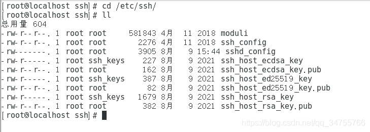
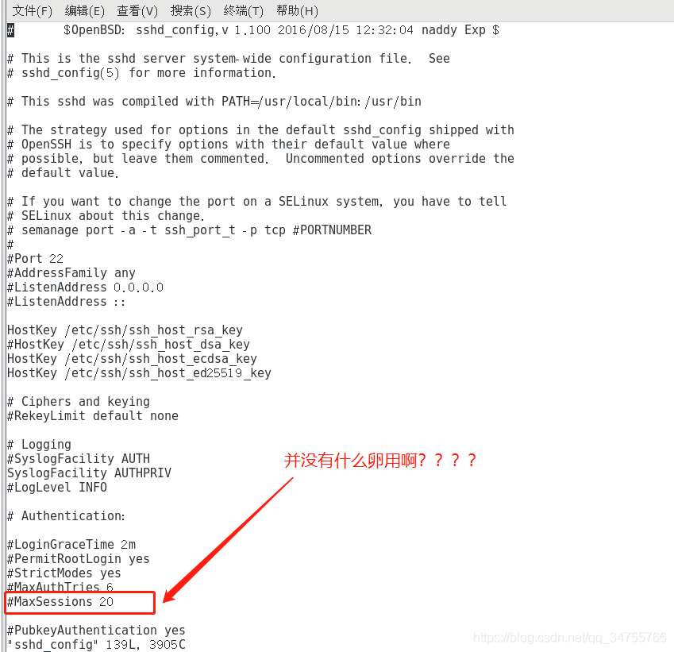
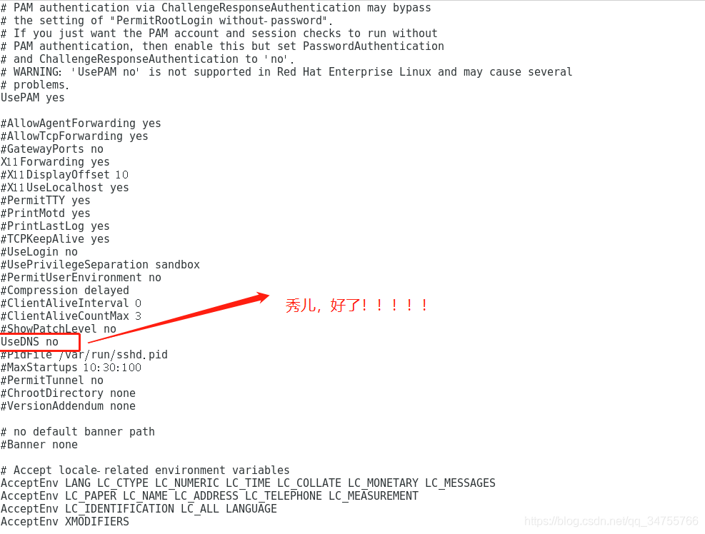

1、今天打算用Linux远程连接工具finalshell连接linux总是连接出现问题，具体情况如下：

centos7的启动没有问题，通过ifconfig查看ip地址，发现finalshell连接工具的ip依旧没有问题连接时，超级慢，之后好不容易连接成功了，过了不久就出现channel is not opened.【通道没有打开？？？？】我也是很懵逼啊！网友们说修改sshd_config 配置文件，修改最大会话数量啥啥的我也都试了一遍。

2、针对修改会话数量的具体情况如下：

```shell
[root@localhost ~]# cd /etc/ssh/
[root@localhost ssh]# ll
```



```shell
[root@localhost ssh]# vi sshd_config
```



上面的MaxSessions原来是10的，后来被我修改成20。修改完成之后重启sshd服务：```systemctl restart sshd.service```然后试着finalshell重新连接一下但是还是没有效果。哈哈哈哈太难了~,后来又看到另一位网友说：修改sshd_config里面的UseDNS=no【原本为yes】


修改完之后保存并且退出，终于可以了，又飞速连接起来了。

